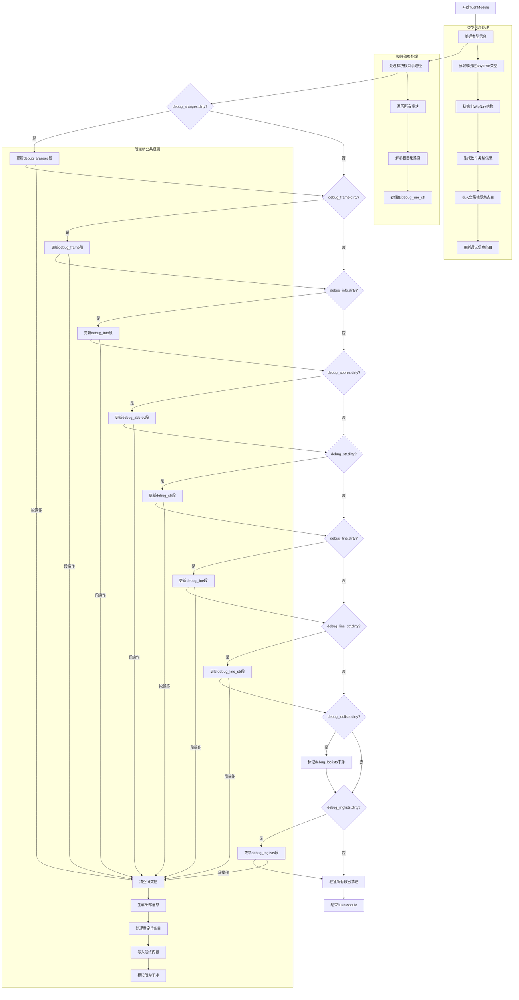

嗯，我需要为这个名为`flushModule`的Zig函数画一个流程图。首先，我需要理解这个函数的结构和逻辑。看起来这个函数主要是处理DWARF调试信息的生成和刷新。让我先通读代码，看看各个部分的作用。

函数开头有一个`type_gop`的处理部分，可能是处理类型信息。然后有一个`wip_nav`的初始化，这可能是一个用于导航或构建DWARF条目的结构体。接着是处理全局错误集名称，生成枚举类型的信息，并更新调试信息部分。

接下来，处理模块的根目录路径，可能是在设置调试行信息的路径。然后处理`debug_aranges`、`debug_frame`、`debug_info`、`debug_abbrev`、`debug_str`、`debug_line`、`debug_line_str`、`debug_loclists`和`debug_rnglists`这些DWARF段。每个部分都有条件判断，如果对应的段是脏的（dirty），则进行更新操作，比如写入头部信息、处理重定位等。最后，确保所有段都不再是脏的。

我需要将这些步骤转化为流程图。可能需要按照函数的执行顺序，将各个条件分支和处理步骤用不同的节点表示。例如，先处理`types`，然后处理`mods`，接着依次检查各个DWARF段是否需要刷新，每个段内部可能有不同的处理逻辑，如写入头部、处理重定位、更新内容等。最后，验证所有段都已处理完毕。

需要注意的是，函数中有多个条件判断（if语句），每个条件对应不同的处理路径。例如，对于`debug_aranges.section.dirty`、`debug_frame.section.dirty`等，每个条件成立时执行相应的代码块。此外，循环结构（如`for`循环）也需要在流程图中体现出来。

另外，代码中使用了多个作用域块（用大括号包裹的部分），这些可能需要作为子流程来处理。例如，第一个块处理类型信息，第二个块处理模块的路径，之后依次处理各个DWARF段。

总结一下，流程图的大致步骤可能是：

1. 处理类型信息（type_gop和wip_nav）
2. 处理模块的根目录路径
3. 检查并处理debug_aranges段
4. 检查并处理debug_frame段
5. 检查并处理debug_info段
6. 检查并处理debug_abbrev段
7. 检查并处理debug_str段
8. 检查并处理debug_line段
9. 检查并处理debug_line_str段
10. 检查并处理debug_loclists段
11. 检查并处理debug_rnglists段
12. 验证所有段都不再是脏的

每个步骤内部可能有更详细的操作，比如写入头部信息、处理重定位条目、更新内容等。此外，每个条件判断需要分支出不同的处理路径，例如，如果某个段是脏的，则执行对应的处理，否则跳过。

在绘制流程图时，需要将这些步骤按顺序排列，并使用条件判断节点（菱形）来决定是否执行某个处理块。同时，循环结构（如for循环遍历模块或单元）需要用循环节点表示。

可能还需要注意错误处理部分，例如`try`语句可能涉及错误传播，但在流程图中可能不需要详细表示，除非有明确的错误处理逻辑。

最后，确保流程图的逻辑与代码的结构一致，所有重要的步骤和条件都被正确表示出来。
================================================
