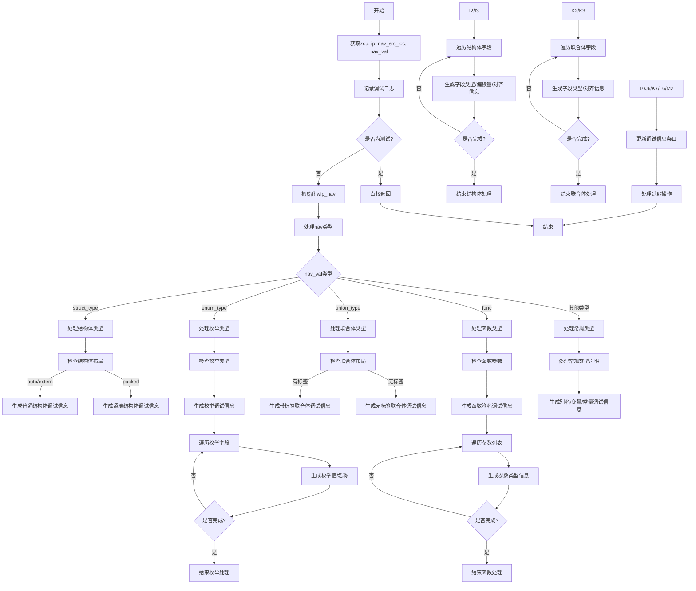

嗯，我需要为这个Zig函数`updateComptimeNavInner`画一个流程图。首先，我应该理解这个函数的结构和逻辑。函数看起来处理不同类型的导航（Nav）并根据不同的类型生成调试信息。函数内部有很多条件判断，比如处理结构体、枚举、联合体等不同类型的情况。

首先，我会尝试理清函数的主要步骤：
1. 获取必要的上下文信息，比如`zcu`、`ip`、`nav_src_loc`、`nav_val`等。
2. 根据`nav`的类型，进入不同的处理分支，比如结构体类型、枚举类型、联合体类型、函数类型等。
3. 每个分支内部可能会进一步处理字段、类型信息，并生成相应的调试信息条目。
4. 处理完成后，更新调试信息的相关部分，如`debug_info`、`debug_line`等。

接下来，我需要考虑如何将这些步骤转化为流程图。流程图应该包括开始、结束、条件判断、处理步骤等节点。可能的结构是：
- 开始节点：函数开始。
- 判断是否为测试（`is_test`），如果是，直接返回。
- 初始化`wip_nav`并进行错误处理。
- 根据`nav_val`的类型进入不同的处理分支（struct, enum, union, func等）。
- 每个分支内部的具体处理步骤，包括字段处理、类型生成等。
- 最后统一处理公共部分，如更新调试信息，处理延迟操作等。

需要注意的条件和循环：
- `switch`语句中的多个case需要转换为不同的条件分支。
- 某些分支内部有循环处理字段（比如结构体的每个字段）。
- 错误处理（`errdefer`）可能需要额外的流程节点。

可能的挑战：
- 处理复杂的嵌套结构，比如结构体内部的字段循环。
- 确保所有条件分支都被正确表示，特别是那些带有嵌套逻辑的分支。
- 正确表示错误处理流程和资源释放（`defer wip_nav.deinit()`）。

为了简化，可能需要将复杂的内部处理（如结构体字段处理）抽象为一个子流程，避免流程图过于庞大。同时，使用不同的形状区分判断节点、处理步骤、开始/结束节点等。

最后，根据上述分析，用Mermaid语法绘制流程图，确保逻辑清晰，步骤正确。
================================================

该流程图展示了：
1. 初始化阶段获取调试上下文
2. 测试类型快速返回
3. 复杂类型（struct/enum/union/func）的专用处理分支
4. 字段遍历的循环结构
5. 最终调试信息更新和资源清理
6. 统一的结束节点

不同类型处理分支采用相似结构：
- 类型特征检查
- 元数据生成
- 字段遍历循环
- 调试信息收尾

通过条件判断和循环结构完整覆盖了原函数中复杂的类型处理逻辑。