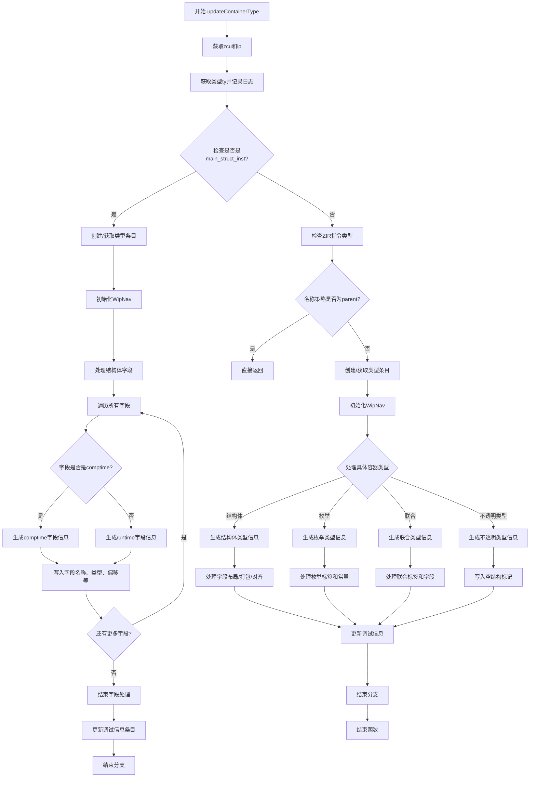

好的，我现在需要帮用户用Mermaid画出给定Zig函数的流程图。首先，我得仔细阅读这个函数，理解它的结构和逻辑流程。

函数名是updateContainerType，看起来是用来更新DWARF调试信息中的容器类型，比如结构体、枚举、联合等。函数参数包括一个Dwarf对象指针、PerThread上下文和类型索引。返回类型是可能的错误。

首先，函数开始部分获取了一些上下文信息，比如zcu和ip。然后根据类型索引获取类型信息ty，并记录日志。接着，检查inst_info是否是主结构实例（main_struct_inst），这似乎是处理结构体的分支。

如果inst_info是main_struct_inst，那么进入第一个分支，处理结构体的字段信息。这里会创建或获取类型条目，初始化WipNav结构，处理结构体的各个字段，包括字段名称、类型引用、偏移量和对齐等。之后，更新调试信息条目。

如果inst_info不是main_struct_inst，则进入另一个分支。这里检查ZIR指令的类型，比如结构体声明、枚举声明等，确定名称策略。如果名称策略是parent，则直接返回。否则，同样创建或获取类型条目，处理不同类型的容器（结构体、枚举、联合、不透明类型等），生成对应的调试信息，并更新相关条目。

接下来，我需要将这两个主要分支拆解成流程图的步骤。首先，函数开始，然后根据条件判断是否为main_struct_inst，分别处理不同的情况。每个分支内部可能有循环处理字段，条件判断字段属性（是否是comptime，是否有初始值等），以及生成不同的缩写码（abbrevCode）和写入调试信息。

在绘制流程图时，需要注意条件判断、循环结构，以及每个步骤的操作。比如，处理结构体字段时，会有for循环遍历所有字段，每个字段内部又有条件判断是否comptime、是否有初始值等，进而选择不同的处理路径。

可能遇到的挑战是正确捕捉所有条件分支和循环，尤其是嵌套的部分。需要确保流程图的每个决策点都清晰，并且各个处理步骤正确连接。此外，函数中有很多错误处理（try语句），但用户可能不需要在流程图中详细展示错误路径，除非特别重要。

最后，整合所有步骤，使用Mermaid的语法绘制流程图，确保逻辑正确，结构清晰。
================================================
