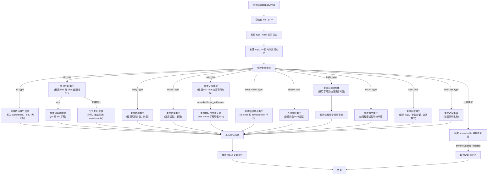

嗯，我现在需要根据提供的Zig代码画出函数的流程图。首先，我得仔细读一遍代码，理解每个部分的作用。这个函数叫做updateLazyType，看起来是处理DWARF调试信息中的类型更新。函数参数包括Dwarf结构体指针、线程相关数据、源位置、类型索引和一个待处理的懒加载列表。

首先，函数开始部分初始化了一些变量，比如zcu和ip，然后根据type_index的不同类型进行不同的处理。接着创建了一个wip_nav结构体，并在之后使用defer来确保资源释放。然后根据不同的type_index类型进入不同的分支，比如int_type、ptr_type、array_type等等，每个分支里都有不同的处理逻辑，比如生成不同的DWARF条目、写入属性等。

我需要把这些分支结构理清楚，画出流程图。可能的结构是，函数开始后根据type_index的不同进入不同的case，每个case执行相应的操作，最后统一处理资源释放和条目替换。需要注意的是，每个case内部可能有更复杂的逻辑，比如循环或条件判断，比如处理tuple_type时的循环遍历字段。

此外，有些case会直接返回或者触发unreachable，比如anyframe_type、adhoc_inferred_error_set等。这些需要在流程图中标出终止点。同时，错误处理部分可能也需要考虑，但代码中大部分错误处理是通过try来传递的，可能不需要特别分支。

接下来，我需要用Mermaid的流程图语法来表示这些逻辑。可能需要使用分支结构，每个type_index对应一个分支，然后在每个分支内部处理具体步骤。需要注意的是，有些分支内部还有子分支，比如ptr_type中的slice情况，或者opt_type中的不同opt_repr情况，这些需要进一步细化。

可能的结构是：

开始 -> 初始化变量和wip_nav -> 根据type_index分多个分支 -> 每个分支处理具体类型 -> 处理完成后统一释放资源和替换条目 -> 结束。

对于每个type_index的分支，比如int_type、ptr_type等，需要详细画出它们的处理步骤，比如调用abbrevCode、写入数据等。不过由于代码较长，可能需要简化，只画出主要分支，而将内部细节合并为步骤块。

此外，循环结构比如tuple_type中的for循环遍历字段，需要用循环节点表示。条件判断比如if语句也需要用条件节点。

最后，需要确保所有可能的路径都被覆盖，包括错误返回和正常流程。不过由于代码中使用的是try，可能错误会直接返回，所以在流程图中可能用箭头指向结束或错误处理节点。

总之，我需要将代码分解成主要的逻辑块，用Mermaid语法结构化地表示出来，确保各分支和循环正确呈现，同时保持流程图的清晰和简洁。
================================================

流程图说明：
1. 函数入口初始化关键变量和调试导航结构体（wip_nav）
2. 根据 type_index 的类型进入不同处理分支
3. 每个分支处理特定类型的 DWARF 调试信息生成逻辑
4. 对复合类型（如元组、枚举）包含循环处理子元素
5. 最终统一写入调试信息并释放资源
6. 特殊类型（如 anyerror）会延迟处理或直接终止流程
7. 所有路径最终汇聚到资源释放和结束节点

关键复杂类型处理：
- 指针类型分 slice/普通指针两种形态
- 可选类型（opt）根据内存布局生成不同联合体结构
- 错误联合类型包含显式的 is_error 标志字段
- 函数类型需要处理调用约定和参数列表
- 元组类型需要遍历所有字段并处理编译时值标记