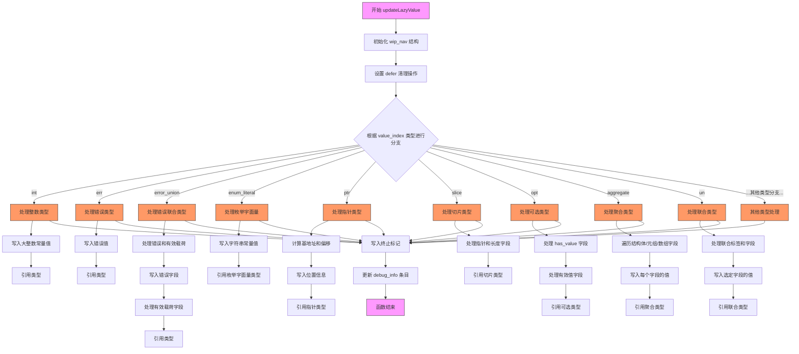

嗯，我需要用Mermaid来画出这个Zig函数的流程图。首先，我得先理解这个函数的结构和逻辑流程。这个函数叫做updateLazyValue，看起来是处理DWARF调试信息相关的逻辑。函数参数包括一个Dwarf结构体指针，一些线程相关的变量，以及需要处理的值的索引等等。

首先，函数开始的时候初始化了一个wip_nav变量，这个变量似乎用于导航和构建调试信息。然后有一个defer块，用于在函数结束时处理pending_lazy列表并释放资源。接下来是一个大的switch语句，根据不同的value_index类型来处理不同的情况。

我需要把整个函数的流程拆解成步骤。可能的大步骤包括：

1. 初始化wip_nav结构。
2. defer块的清理操作。
3. 根据value_index的不同类型进入不同的处理分支，比如处理int类型、err类型、error_union类型等等。
4. 每个分支内部可能有更细的处理步骤，比如写入不同的调试信息、处理字段、处理类型引用等。
5. 最后替换debug_info中的条目。

接下来，我需要将这些步骤转化为Mermaid的流程图语法。每个主要步骤作为一个节点，条件判断作为菱形框，不同的分支作为不同的路径。需要注意的是，switch语句中的每个case都是一个分支，可能需要多个菱形框来表示不同的条件判断。

不过，由于这个函数中的switch语句非常庞大，包含很多不同的case，直接全部画出来可能会非常复杂。可能需要简化，只画出主要的流程分支，而不是每一个具体的case。或者，按主要case分组，比如基本类型处理、复合类型处理等。

另外，要注意函数的开始和结束节点，以及错误处理部分。这个函数返回一个错误联合类型，所以可能有错误处理的流程，但看起来函数内部使用try来传播错误，所以错误处理可能集中在某个节点。

现在，我需要将上述思考转化为具体的Mermaid流程图。可能需要以下步骤：

- 开始节点：函数开始。
- 初始化wip_nav。
- defer块的设置。
- switch语句开始，根据value_index的类型判断。
- 每个case分支的处理，例如处理int、err、error_union等。
- 每个分支内的具体操作，比如写入调试信息、处理字段等。
- 结束节点：替换debug_info条目，函数结束。

需要确保流程图的逻辑清晰，每个判断和操作都正确表示。可能需要对复杂的case进行合并或简化，以保持流程图的可读性。
================================================

该流程图特点：
1. 使用菱形分支节点表示类型判断
2. 主要类型分支用不同颜色标注
3. 每个分支包含关键操作步骤
4. 保留通用处理流程（如类型引用、终止标记写入）
5. 最终统一到更新 debug_info 的公共路径
6. 简化了复杂类型的具体处理细节，保留主干逻辑
7. 使用开始/结束的紫色节点增强可读性

对于非常复杂的 switch-case 结构，此图通过：
- 合并相似操作模式
- 突出核心类型分支
- 省略重复细节
来保持流程图的简洁性和可读性。