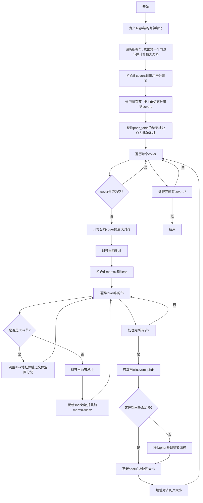

好的，我需要为给定的Zig函数`allocateAllocSections`绘制一个Mermaid流程图。首先，我需要仔细阅读并理解这个函数的逻辑。

首先，函数开始定义了一个内部结构`Align`，用于跟踪TLS段的最大对齐。然后遍历所有节（sections），找出第一个TLS节并计算最大对齐值。

接下来，函数处理分配段（segments）的覆盖范围。它根据节的标志（flags）将节分组到不同的段中。这里使用了一个数组`covers`来存储每个段包含的节索引。

然后，函数为每个段分配虚拟内存地址。计算每个段的最大对齐，并调整起始地址。在处理每个段内的节时，特别处理了.tbss类型的节，这些节不需要实际的文件空间，但需要调整内存地址。

之后，函数处理文件偏移，确保有足够的空间，并在必要时移动段的位置。这里涉及到文件操作，比如复制数据到新的偏移位置。

最后，更新程序头（phdr）的信息，包括虚拟地址、内存大小、文件大小和对齐方式。

现在，我需要将这些步骤转化为流程图。流程图应该包括主要的决策点和处理步骤。需要注意循环和条件判断的结构，比如遍历节、处理.tbss节、调整偏移等。

可能需要将流程分为几个主要部分：
1. 初始化和对齐计算
2. 分组节到段
3. 分配虚拟地址
4. 处理文件偏移和移动数据
5. 更新程序头信息

在绘制时，要确保每个步骤之间的逻辑关系清晰，尤其是循环和条件分支。例如，遍历所有节时，需要判断是否为TLS节，是否属于同一段等。

另外，需要处理异常情况，比如文件复制失败时的错误返回，但流程图可能不需要详细展示错误处理，除非特别重要。

最后，整理这些步骤，用Mermaid的语法结构表达出来，确保节点和箭头正确反映函数的执行流程。
================================================
