嗯，用户让我用Mermaid画出这个Zig函数的流程图。首先，我需要仔细阅读并理解这段代码的结构和逻辑。这个函数名为`flushModuleInner`，属于Elf模块。看起来是处理链接过程中的各个步骤，比如处理对象文件、符号解析、内存分配、写入输出文件等。

首先，我会分步骤分析函数的执行流程。函数开始部分处理模块对象路径，检查是否有Zig对象需要刷新。然后根据输出模式（Obj、Lib、Exe）决定不同的处理路径。接着处理符号解析、垃圾回收、重复检查等。之后是初始化各种节（sections）、分配内存、处理重定位，最后写入ELF头和其他部分，处理错误。

接下来，我需要将这些步骤转化为流程图的结构。每个主要操作对应一个节点，条件判断对应分支，错误处理可能需要单独的路径。需要注意的是，有些步骤可能包含循环，比如遍历对象或原子（atoms）。同时，错误处理的部分可能需要合并，因为多个地方可能返回相同的错误。

可能会遇到的问题是代码中的条件分支和循环如何准确表示。例如，`if (module_obj_path)`和`switch (comp.config.output_mode)`需要不同的分支。另外，像`for (self.objects.items) |index|`这样的循环结构也需要在流程图中体现。

需要确认每个步骤的先后顺序，以及哪些是并行的，哪些是顺序的。例如，符号解析必须在分配内存之前完成，而写入各个节可能在最后阶段。

还需要注意错误处理流程，比如当`diags.hasErrors()`为真时，直接返回错误。这些错误检查点需要作为决策节点出现在流程图中。

最后，确保流程图的逻辑与代码完全一致，没有遗漏关键步骤，并且结构清晰，易于理解。
================================================

```mermaid
graph TD
    A[开始flushModuleInner] --> B[处理模块对象路径]
    B --> C{是否有ZigObject需要flush?}
    C --> |是| D[调用zig_object.flush]
    C --> |否| E[继续流程]
    D --> E
    E --> F{输出模式是什么?}
    F --> |Obj| G[调用relocatable.flushObject]
    F --> |Lib| H{链接模式是动态还是静态?}
    H --> |static| I[调用relocatable.flushStaticLib]
    H --> |dynamic| J[继续流程]
    F --> |Exe| J
    G --> K[检查错误]
    I --> K
    J --> K
    K --> L{存在错误?}
    L --> |是| M[返回LinkFailure]
    L --> |否| N[创建linker_defined输入文件]
    N --> O[跨文件解析符号]
    O --> P[标记EhFrameAtoms为dead]
    P --> Q[解析合并节]
    Q --> R[转换公共符号]
    R --> S[标记导入导出]
    S --> T{启用GC?}
    T --> |是| U[执行GC]
    U --> V{打印GC节?}
    V --> |是| W[输出GC节信息]
    W --> X[检查重复符号]
    V --> |否| X
    T --> |否| X
    X --> Y{发现重复?}
    Y --> |是| Z[返回LinkFailure]
    Y --> |否| AA[添加注释字符串]
    AA --> AB[最终化合并节]
    AB --> AC[初始化输出节]
    AC --> AD[初始化start/stop符号]
    AD --> AE[处理未解析符号]
    AE --> AF[扫描重定位]
    AF --> AG[生成合成节]
    AG --> AH[初始化特殊Phdrs]
    AH --> AI[排序节头]
    AI --> AJ[设置动态节]
    AJ --> AK[排序动态符号表]
    AK --> AL[设置哈希节]
    AL --> AM[设置版本符号表]
    AM --> AN[排序init/fini]
    AN --> AO[更新节大小]
    AO --> AP[添加加载Phdrs]
    AP --> AQ[分配Phdr表]
    AQ --> AR[分配alloc节]
    AR --> AS[排序Phdrs]
    AS --> AT[分配非alloc节]
    AT --> AU[分配特殊Phdrs]
    AU --> AV[调试日志输出]
    AV --> AW[清理对象状态]
    AW --> AX[处理重定位]
    AX --> AY{存在重定位错误?}
    AY --> |是| AZ[返回LinkFailure]
    AY --> |否| BA[写入Phdr表]
    BA --> BB[写入Shdr表]
    BB --> BC[写入Atoms]
    BC --> BD[写入合并节]
    BD --> BE[写入合成节]
    BE --> BF{存在错误?}
    BF --> |是| BG[返回LinkFailure]
    BF --> |否| BH{是Exe且无entry point?}
    BH --> |是| BI[设置无入口点标志]
    BH --> |否| BJ[写入ELF头]
    BI --> BK[最终错误检查]
    BJ --> BK
    BK --> BL{存在错误?}
    BL --> |是| BM[返回LinkFailure]
    BL --> |否| BN[正常结束]
``` 

该流程图展示了：
1. 从路径处理到符号解析的核心逻辑流
2. 关键条件分支（输出模式、错误检查、GC处理等）
3. 内存分配和节处理的核心阶段
4. 最终文件写入和验证过程
5. 贯穿始终的错误处理机制
6. 特殊符号和节的处理流程（如linker_defined、synthetic sections等）

使用缩进表示子流程，菱形节点表示条件判断，矩形节点表示操作步骤，圆形节点表示流程端点。颜色建议：
- 绿色：开始/结束节点
- 黄色：关键操作节点
- 红色：错误处理路径
- 蓝色：文件写入操作