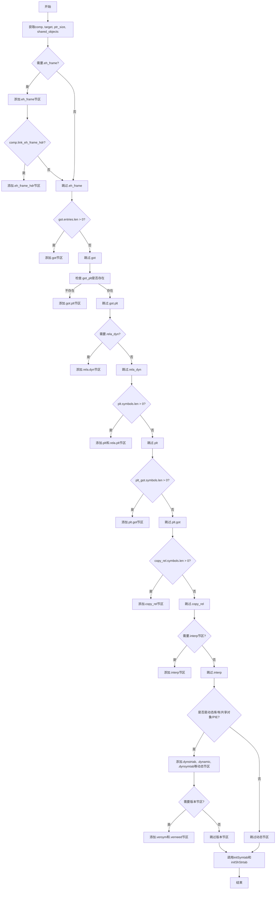

嗯，我现在需要为这个名为initSyntheticSections的Zig函数画一个流程图。首先，我得仔细理解这个函数的功能。看起来这个函数是初始化ELF文件中的一些合成节区（synthetic sections）。ELF文件格式我之前学过一点，合成节区可能是指链接器在链接过程中生成的节区，比如.got、.plt、.eh_frame等等。

首先，函数开始部分获取了一些变量，比如comp、target、ptr_size和shared_objects。然后检查是否需要.eh_frame节区。这里用了一个块表达式blk来判断是否有需要。如果有，就创建.eh_frame和可能的.eh_frame_hdr节区。

接下来是处理.got和.got.plt节区，如果有条目的话。然后是检查是否需要.rela.dyn节区，这取决于一些标志或是否有动态重定位条目。之后处理.plt和.rela.plt，如果存在PLT符号的话。

然后是处理.plt.got和.copyrel节区，如果对应的符号存在。接下来是判断是否需要.interp节区，这涉及到是否是静态链接以及是否有动态链接器路径。之后处理动态链接相关的节区，如.dynstr、.dynamic、.dynsym、.hash、.gnu.hash，以及版本相关的节区如.versym和.verneed。

最后调用initSymtab和initShStrtab来初始化符号表和节区字符串表。

现在要画流程图，需要考虑各个条件分支。流程图应该从函数入口开始，然后按照各个条件判断分支，如是否需要.eh_frame，是否需要.got等。每个条件判断后的操作是添加相应的节区。需要注意各个条件的嵌套关系和执行顺序。

可能的步骤是：

1. 开始
2. 获取comp, target等变量
3. 检查是否需要.eh_frame
   - 是：添加.eh_frame和可能的.eh_frame_hdr
4. 检查.got是否有条目，添加.got节区
5. 添加.got.plt节区（总是添加？或者有条件？看代码中.got_plt是否为空，所以可能如果不存在则添加）
6. 检查是否需要.rela_dyn，添加.rela.dyn
7. 处理.plt和.rela_plt
8. 处理.plt_got和.copy_rel
9. 判断是否需要.interp节区，添加
10. 处理动态库相关节区：dynstrtab、dynamic、dynsymtab、hash、gnu_hash
11. 检查是否需要版本节区，添加versym和verneed
12. 调用initSymtab和initShStrtab
13. 结束

需要注意的是，有些节区的添加是有条件的，比如是否处于动态链接库，是否有共享对象，或者配置了PIE等。需要正确表达这些条件分支。

可能遇到的难点是如何正确表达嵌套的条件判断，比如needs_eh_frame的计算涉及到循环检查对象文件中的cies条目。此外，某些节区的添加可能依赖于多个条件，比如needs_interp的判断涉及静态链接和动态链接器的存在。

另外，像在动态节区处理部分，有多个子条件，比如是否需要versions节区，这需要遍历dynsym的条目，检查符号的版本信息。这可能在流程图中需要单独的条件判断框。

在组织流程图时，可能需要将每个主要节区的处理作为一个分支，按顺序排列，每个分支内部处理相应的条件判断和添加节区的步骤。使用菱形表示条件判断，矩形表示操作步骤，箭头连接流程。
================================================
