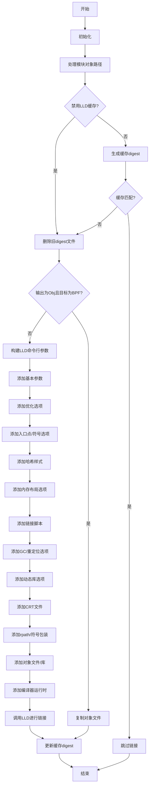

嗯，我需要为这个Zig函数`linkWithLLD`画一个流程图。首先，我应该先通读整个函数，理解它的主要步骤和逻辑结构。这个函数看起来是用于链接ELF文件的，使用LLD作为链接器。

首先，函数开始做一些初始检查，比如`dev.check(.lld_linker);`，可能是在确认是否使用LLD链接器。然后获取一些上下文变量，比如`comp`、`gpa`、`diags`等。接下来处理输出路径，并检查是否有Zig代码需要编译，从而决定是否需要刷新模块。

然后，函数处理缓存相关的内容，生成一个digest来判断是否需要重新链接。如果缓存命中，就直接返回；否则继续执行链接步骤。

在链接部分，函数分为两种情况：当输出是对象文件且目标架构是BPF时，直接复制对象文件；否则，构建LLD的命令行参数并调用LLD进行链接。这部分包括添加各种链接选项，处理输入文件、库依赖等。

最后，更新缓存信息并处理锁的释放。

接下来，我需要将这些步骤转化为流程图。流程图应该包括主要的分支和循环，比如缓存检查、不同的链接路径（直接复制或调用LLD）、错误处理等。

需要注意的条件包括：
1. 是否禁用LLD缓存（`disable_lld_caching`）。
2. 输出模式是否为对象文件（`output_mode == .Obj`）以及目标架构是否为BPF。
3. 各种链接选项和参数的添加，比如`-r`、`--sysroot`、`-m`等。
4. 处理不同的库和对象文件，包括静态库、动态库、编译器运行时等。

可能的结构：
- 开始
- 初始化变量和检查
- 处理模块对象路径
- 检查缓存digest
  - 如果digest匹配，跳过链接
  - 否则继续
- 判断是否需要简单文件复制（BPF特殊情况）
  - 是：执行文件复制
  - 否：构建LLD命令并执行
- 处理命令行参数
- 调用LLD
- 更新缓存和锁

过程中需要处理错误，但流程图可能不需要详细展示错误处理，除非是关键分支。

现在，我需要将这些步骤用mermaid语法组织起来，确保逻辑正确，分支清晰。
================================================
