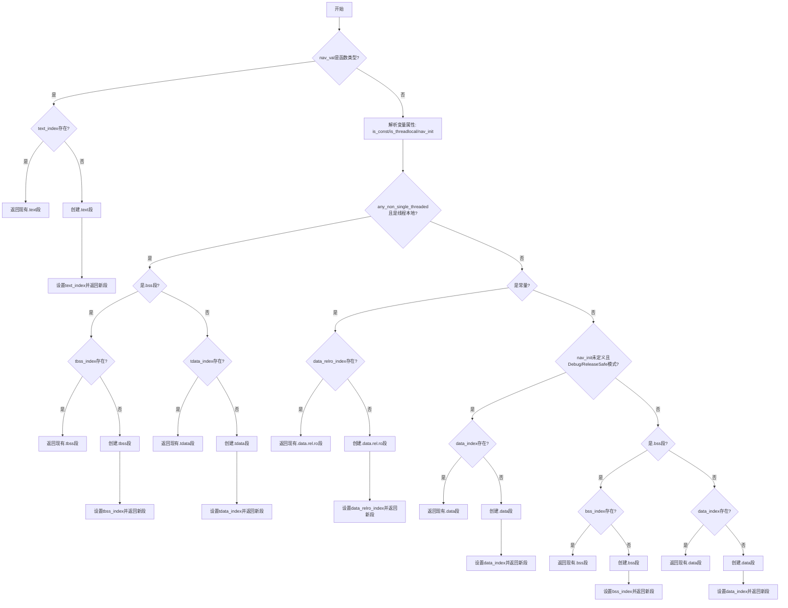

嗯，用户让我用Mermaid画出一个Zig函数的流程图。首先，我需要仔细理解这个函数的结构和逻辑。函数名是getNavShdrIndex，看起来是处理ELF文件中的段（section）索引的。

首先，函数开头有一些参数，比如self、elf_file、zcu等。然后，定义了一些变量，比如gpa、ptr_size、ip、any_non_single_threaded，接着获取nav_val。然后，检查nav_val的类型是否是函数类型，如果是的话，处理.text段的相关逻辑，可能创建或返回已有的.text段。

接下来是处理不同类型的变量，比如is_const、is_threadlocal、nav_init。根据这些变量的值，函数会进入不同的分支。例如，如果是线程本地存储（TLS）且非单线程环境，会处理.tbss或.tdata段。如果是常量，则处理.data.rel.ro段。如果初始化值为未定义，根据优化模式选择.data或.bss段。最后，根据是否有重定位或数据内容决定使用.bss还是.data段。

需要注意每个条件分支的走向，比如if (any_non_single_threaded and is_threadlocal) 这个条件，内部还有进一步的判断是否是bss（全零数据）。然后根据情况返回对应的段索引或创建新段。

还有，每个条件分支中，可能会检查是否已经存在对应的段符号（比如self.tbss_index是否存在），如果存在就直接返回，否则创建新段并记录索引。

流程图需要涵盖所有条件分支和可能的返回路径。可能需要使用不同的节点表示条件判断、操作步骤以及返回结果。需要确保每个条件分支的正确连接，特别是嵌套的条件结构。

比如，函数开始后，首先检查是否是函数类型，如果是，处理.text段。否则，进入变量类型判断，然后根据线程本地、常量、初始化值等情况分支。每个分支内部可能还有进一步的判断，比如是否是bss段，是否有重定位等。

最后，需要将所有可能的路径都画出来，确保流程图的准确性和完整性。可能需要多次检查代码逻辑，确保没有遗漏任何条件或返回点。
================================================
