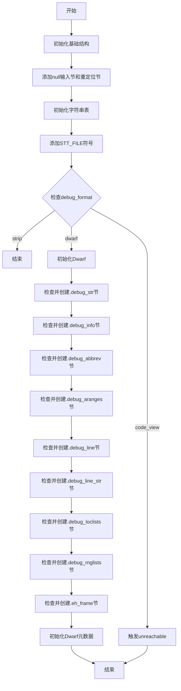

嗯，我现在需要帮用户用Mermaid画出这个Zig函数的流程图。首先，我应该仔细读一下这个函数的代码，理解它的结构和逻辑。

这个函数是ZigObject的init方法，看起来是初始化一个ELF文件相关的对象。参数有self指针、elf_file指针和options。函数里有很多条件判断和循环，特别是处理调试信息的部分。

首先，函数一开始忽略options，获取comp和gpa，以及ptr_size。然后向atoms和relocs添加空项，初始化strtab。接下来，添加一个类型为STT_FILE的符号到符号表。这部分应该是设置基础结构。

然后根据comp.config.debug_format的值，如果是strip，就什么都不做；如果是dwarf，则初始化Dwarf，并创建一系列的调试节（如.debug_str、.debug_info等）。每个调试节的创建流程类似：检查是否已存在，不存在则创建新的section，并添加符号和atom。最后初始化dwarf的元数据，并赋值给self.dwarf。如果是code_view，则unreachable。

接下来，我需要将这些步骤分解成流程图中的各个节点。流程图的开始是函数入口，然后按顺序处理各个步骤。条件判断部分（debug_format）会有分支，dwarf的情况下有很多子步骤，每个调试节的创建都是一个判断是否存在，不存在则创建的过程。

需要注意的是，每个调试节的创建都是类似的，可能需要合并成一个循环或者用统一的节点表示，但代码中是逐个检查的，可能需要分别处理。或者，可以简化为一个“创建调试节”的节点，里面包含多个子步骤。

另外，函数中有很多错误处理（try），但流程图可能不需要显示错误路径，除非用户特别要求。根据用户的问题，可能只需要主流程。

最后，用Mermaid的语法将各个步骤和判断结构画出来。可能的结构如下：

开始 -> 初始化基础结构 -> 添加文件符号 -> 判断debug_format
如果是strip，结束
如果是dwarf，初始化Dwarf -> 逐个检查并创建各个调试节 -> 初始化Dwarf元数据 -> 结束

每个调试节的创建可能是一个条件判断，如果不存在则创建。但这样会导致流程图很复杂，可能需要简化。

可能需要将所有的调试节创建合并为一个步骤，比如“创建必要的调试节”，然后内部有多个子流程。但用户提供的代码中是逐个处理的，所以可能需要分别表示每个节的检查与创建。

不过，考虑到流程图的可读性，可能更适合将每个调试节的创建作为一个单独的节点，例如“检查.debug_str是否存在，不存在则创建”等等。但这样会有很多重复的节点，可能显得冗长。

另一种方法是，在dwarf分支下，有一个循环或子流程，处理所有调试节的创建，但代码中是顺序执行而非循环，所以可能需要逐一列出。

综上，我会尝试将主要的步骤列出来，对于每个调试节的创建，可能合并成一个步骤，或者简要说明。这样流程图不会太复杂，同时能反映代码的主要逻辑。
================================================
