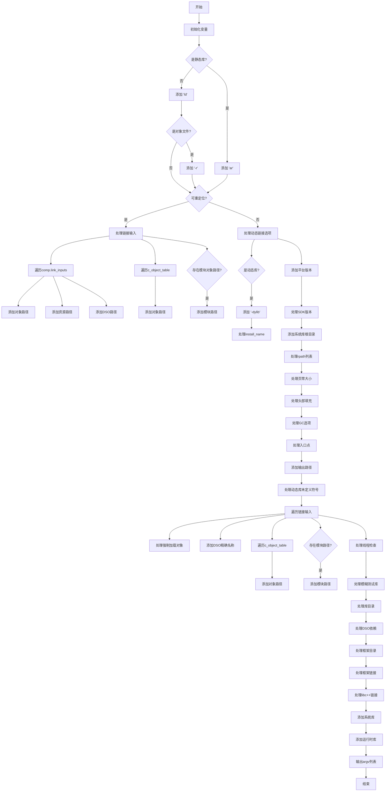

好的，我需要帮用户将提供的 Zig 函数 `dumpArgv` 转换为 Mermaid 流程图。首先，我得仔细阅读这段代码，理解它的逻辑结构。函数的主要功能是构建一个命令行参数列表（argv）用于链接器（如 ld 或 ar），根据不同的条件添加不同的参数。

首先，函数初始化了一些变量，比如 `arena_allocator` 和 `directory`。然后根据不同的条件判断，比如是否是静态库、是否是动态库等，添加相应的命令行参数。例如，如果是静态库，就添加 "ar"，否则添加 "ld"。接着处理各种链接输入，如对象文件、归档文件、动态共享对象等，并将它们的路径添加到 argv 中。此外，还处理了诸如平台版本、SDK 版本、系统根目录、rpath、页零大小、头部填充大小等选项。

接下来，我需要将这一系列的条件判断和循环转换为流程图的结构。流程图的开始是函数入口，然后按顺序处理各个步骤，包括初始化、条件分支（如是否是静态库、是否是动态库等）、循环处理链接输入和各种选项，最后调用 `Compilation.dump_argv` 输出构建好的 argv。

需要注意的是，代码中有多个条件分支，比如 `if (self.base.isStaticLib())`、`if (self.base.isObject())`、`if (self.base.isRelocatable())` 等，这些都需要在流程图中用判断节点表示。循环部分，比如 `for (comp.link_inputs)` 和 `for (self.lib_directories)` 等，需要用循环节点表示。

可能遇到的挑战是如何清晰地组织这些复杂的分支和循环，避免流程图过于混乱。需要合理分组，使用子流程或者适当的注释来保持可读性。此外，确保每个条件分支的正确流向，比如每个 `if-else` 的两个分支都要明确指向接下来的步骤。

最后，确认所有步骤都被正确转换，并且流程图的逻辑与代码完全一致，没有遗漏任何关键步骤或条件。
================================================
