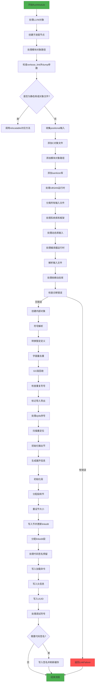

好的，我需要为给定的Zig函数`flushModule`绘制一个Mermaid流程图。首先，我需要仔细阅读并理解这个函数的逻辑结构。

函数`flushModule`的主要任务似乎是处理Mach-O文件的链接和生成过程。它包含了多个步骤，比如处理LLVM对象、静态库和对象文件的生成、处理链接输入、解析系统库、符号解析、段和节的分配与写入、代码签名等。

首先，我需要将整个函数分解成主要的步骤。例如，函数开始部分处理LLVM对象，然后是处理静态库和对象文件。接着，收集并分类各种链接输入，如位置相关的对象文件、系统库、框架等。之后，解析依赖的动态库，处理符号解析、去重、垃圾回收（GC）段、检查重复符号等。然后是分配段和节，计算大小，生成展开信息，写入节和段，处理调试符号，最后是代码签名。

接下来，我需要将这些步骤按照执行顺序排列，并确定各步骤之间的条件分支和错误处理。例如，某些步骤可能只有在特定条件下才会执行，比如只有在启用线程检查器（TSan）或模糊测试（fuzz）时才会添加相应的库。此外，错误处理部分也需要在流程图中体现，比如当出现错误时如何跳转到错误处理或返回错误。

需要注意的是，Zig的错误处理机制（如`try`和`catch`）会影响流程的分支。例如，当调用`self.classifyInputFile`时，如果出现错误，会通过`diags.addParseError`记录错误，但流程可能继续执行。而有些错误会导致直接返回错误，如`return error.LinkFailure`。

在绘制流程图时，需要将这些条件分支和错误处理路径用决策节点表示。同时，循环结构如`for (comp.link_inputs)`也需要用循环节点表示。

另外，函数中涉及多个子过程，如`resolveSymbols`、`convertTentativeDefsAndResolveSpecialSymbols`、`dedupLiterals`等，这些应作为流程中的子步骤。

最后，代码签名部分仅在满足特定条件时执行，例如`if (codesig) |*csig|`，这也需要在流程图中体现。

总结来说，绘制该函数的流程图需要：

1. 分解函数的主要步骤。
2. 确定步骤之间的顺序和条件分支。
3. 处理错误路径和返回点。
4. 表示循环和子过程调用。
5. 处理代码签名等条件步骤。

在绘制时，可能会遇到如何处理复杂错误处理和条件分支的挑战，需要确保每个可能的执行路径都被正确表示，同时保持流程图的可读性。
================================================

这个流程图展示了：
1. 从初始化处理到最终写入的完整流程
2. 主要错误检查点（红色节点表示错误返回）
3. 关键决策分支（菱形节点）
4. 核心处理步骤（矩形节点）
5. 特殊处理阶段（代码签名等）
6. Zig特有的错误处理流程

每个处理步骤都对应代码中的关键操作，保持了与源代码结构的高度对应，同时通过颜色区分正常流程和错误路径。