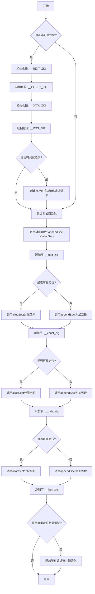

嗯，我现在需要理解这段Zig代码，并画出它的流程图。首先，这个函数叫做initMetadata，属于MachO结构体的方法。它接受一个指向MachO的指针和一个InitMetadataOptions类型的参数，返回一个错误联合类型。让我先大致看一下代码的结构。

函数一开始检查self.base.isRelocatable()是否为false。如果不是可重定位的，就执行一些初始化操作。这里有几个块，每个块似乎都在添加不同的段（segment），比如__TEXT_ZIG、__CONST_ZIG、__DATA_ZIG和__BSS_ZIG。每个段都有不同的属性，比如vmaddr、filesize、prot等。其中，__BSS_ZIG段的filesize是0，而vmsize是1024，这可能是一个未初始化的数据段。

接下来，如果options.zo.dwarf存在，就创建dSYM bundle，并初始化相关的调试信息。然后，函数定义了两个内部函数appendSect和allocSect，这两个函数用于处理段的分配和附加。

之后，代码添加了多个节（section），如__text_zig、__const_zig、__data_zig和__bss_zig，并根据是否是可重定位的目标文件，选择使用allocSect还是appendSect来处理这些节。最后，如果是可重定位的并且有调试信息，会添加多个调试相关的节，并初始化调试信息。

现在，我需要将这些步骤转化为流程图。首先，流程的开始是函数入口，然后检查是否是可重定位的。如果不是，就初始化各个段，处理调试信息。然后定义两个辅助函数。接下来，添加各个节，根据是否可重定位选择不同的处理方式。最后处理调试节。

需要注意的是条件分支，比如if (!self.base.isRelocatable())，以及内部的多个块结构。此外，辅助函数appendSect和allocSect可能在多个地方被调用，但它们在流程图中可能需要作为子流程或步骤来表示。

可能的结构是：

1. 开始
2. 检查是否非可重定位
   - 是：初始化各段（__TEXT_ZIG等）
   - 是：处理dSYM bundle
3. 定义appendSect和allocSect
4. 添加各个节（text, const, data, bss）
   - 对于每个节，根据是否可重定位选择allocSect或appendSect
5. 如果是可重定位且有调试信息，添加调试节并初始化
6. 结束

需要确保每个条件分支和循环都被正确表示。可能需要使用条件判断框，例如菱形符号，来表示判断条件。每个步骤中的操作如添加段、处理空间分配等需要详细列出。

可能忽略了一些细节，比如具体的参数传递或函数调用内部的步骤，但流程图应该主要关注主流程。另外，注意处理异常情况，比如try可能引发的错误，但流程图可能不需要显示错误处理路径，除非特别重要。

现在，根据这些分析，可以开始绘制mermaid流程图了。使用合适的节点和箭头，表示条件判断、函数调用和步骤顺序。
================================================

流程图说明：
1. **入口**：函数开始后首先检查是否是非可重定位文件。
2. **段初始化**：若非可重定位，依次初始化`__TEXT_ZIG`、`__CONST_ZIG`、`__DATA_ZIG`、`__BSS_ZIG`四个段，并处理调试信息。
3. **辅助函数**：定义`appendSect`（附加节到段）和`allocSect`（动态分配节空间）。
4. **节处理**：对每个节（`__text_zig`、`__const_zig`、`__data_zig`、`__bss_zig`），根据是否可重定位选择分配方式。
5. **调试节**：若为可重定位且开启调试，添加所有`__DWARF`相关节并初始化。
6. **结束**：流程结束。