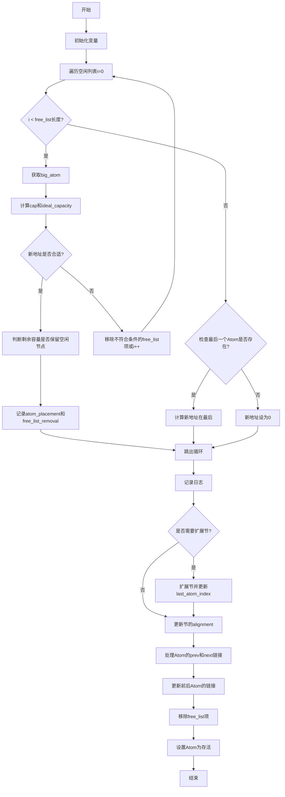
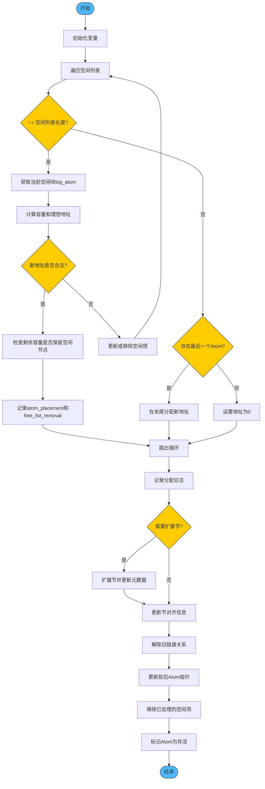

嗯，我现在需要帮用户用Mermaid画一个流程图，基于他们提供的Zig代码中的`allocate`函数。首先，我需要仔细阅读这段代码，理解它的逻辑，然后逐步转化为流程图的结构。

首先，这个函数`allocate`的作用是为一个Atom分配内存空间。看起来它属于Mach-O文件处理的一部分。函数的大致流程是这样的：

1. 获取Zig对象、节头、空闲列表等信息。
2. 计算新Atom的理想容量。
3. 尝试在空闲列表中找到合适的位置放置新Atom。
4. 如果找到合适的位置，更新相关元数据；否则，可能在最后一个Atom之后扩展节。
5. 处理前后Atom的链接关系，更新空闲列表。
6. 最后标记Atom为存活状态。

接下来，我需要将这些步骤分解成流程图的各个节点和判断条件。例如，在寻找空闲列表节点时，有一个循环遍历空闲列表中的项，判断是否满足条件。如果找到合适的块，则处理剩余容量是否需要保留空闲节点；否则，检查是否有最后一个Atom可以扩展。

需要特别注意条件分支，比如是否找到空闲节点、是否有足够的剩余容量保留空闲节点、是否需要扩展节等。此外，还有一些错误处理和回滚的逻辑，但代码中似乎通过延迟处理元数据更新来避免中间出错的问题。

可能的流程图结构：

- 开始
- 初始化变量（zo, sect, free_list等）
- 遍历空闲列表寻找合适的块
  - 对于每个空闲块，检查是否足够容纳新Atom
  - 是：计算新起始地址，判断是否需要保留空闲节点，记录放置位置和可能的空闲列表移除
  - 否：继续下一个块
- 如果遍历完没有找到，则尝试在最后一个Atom后扩展
- 计算最终的self.value（新Atom的起始地址）
- 记录日志
- 判断是否需要扩展节（expand_section）
  - 是：扩展节，更新last_atom_index
- 更新节的alignment
- 处理Atom的前后链接（prev和next索引）
- 如果有atom_placement，更新前后Atom的链接关系
- 移除不需要的空闲列表项
- 设置Atom为存活状态
- 结束

需要将这些步骤用Mermaid的流程图语法表示出来，注意条件判断和循环结构。例如，循环遍历空闲列表可能需要用循环节点表示，但由于Mermaid不支持显式循环结构，可能需要用条件判断来模拟。

另外，要注意代码中的else块对应的情况，比如没有找到合适的空闲块时处理最后一个Atom的情况。

在绘制过程中，可能需要将某些步骤合并或拆分，以保持流程图的清晰。例如，处理空闲列表的循环可能需要分解为多个判断节点，表示每次检查一个块是否符合条件，然后继续下一个。

还需要处理错误情况，比如`try macho_file.growSection`可能抛出错误，但根据代码中的注释，这部分在函数末尾处理错误时已经确保不会出现错误，所以可能不需要在流程图中体现错误处理分支。

总结下来，流程图的步骤大致如下：

1. 开始
2. 初始化变量
3. 遍历空闲列表：
   a. 检查每个块是否足够大
   b. 是：计算新地址，判断剩余容量是否保留空闲节点
   c. 否：继续下一个块
4. 如果遍历完未找到，检查最后一个Atom是否存在
   a. 存在：在其后分配新地址
   b. 不存在：起始地址设为0
5. 记录分配日志
6. 判断是否需要扩展节
   a. 需要扩展：调用growSection，更新last_atom_index
7. 更新节的alignment
8. 解除旧链接（如果重新分配）
9. 更新前后Atom的链接关系
10. 移除已处理的空闲列表项
11. 设置Atom为存活
12. 结束

现在，将这些步骤转换为Mermaid语法，使用条件判断和操作节点。例如，遍历空闲列表可以用一个判断节点“是否有空闲块未检查？”，然后分支处理每个块的条件。

需要注意的是，Mermaid的流程图不支持循环结构直接表示，所以需要用条件判断来模拟循环。例如，使用一个“i < free_list长度”的判断节点，如果是，则处理当前块，否则进入else分支。

可能的结构如下：

可能需要调整一些步骤的顺序，例如处理prev和next链接可能在更新链接关系之后。另外，代码中的某些步骤可能需要更详细的节点，比如解除旧链接（如果Atom被重新分配）。

此外，在代码中，处理prev和next链接的部分是在确定atom_placement之后进行的，所以流程图中应反映这一点。

可能还需要将“处理Atom的prev和next链接”分为几个步骤，比如检查是否有prev和next，并更新它们的索引。

总结后，最终的Mermaid流程图应涵盖所有主要步骤和条件分支，确保逻辑正确且易于理解。
================================================

该流程图完整展示了函数的执行逻辑：
1. **初始化阶段**：获取节信息、空闲列表等基础数据
2. **空闲列表遍历**：
   - 通过循环检查每个空闲块是否可容纳新Atom
   - 合法时计算地址并判断是否需要保留剩余空间
3. **后备分配**：当空闲列表不满足时，尝试在最后一个Atom后扩展
4. **节扩展处理**：根据分配情况动态扩展节空间
5. **链接维护**：更新Atom的前后指针关系，维护双向链表结构
6. **清理阶段**：移除已使用的空闲项，最终标记Atom为存活状态

菱形节点表示关键判断条件，黄色背景突出显示主要决策点，蓝色圆角矩形表示流程开始/结束。