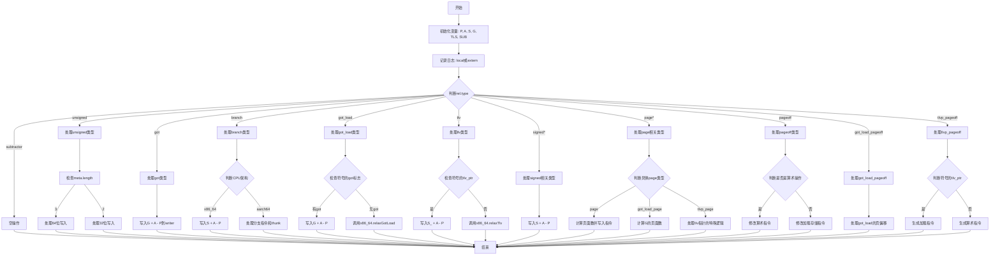

嗯，我需要帮用户把提供的Zig函数`resolveRelocInner`用Mermaid画出流程图。首先，我得理解这个函数的结构和逻辑。

函数的主要任务似乎是处理重定位（relocation），根据不同的重定位类型执行不同的操作。函数内部有很多switch语句，根据`rel.type`和`rel.tag`等条件分支到不同的处理逻辑。例如，处理`.unsigned`、`.got`、`.branch`等类型。

接下来，我需要将这些逻辑分支转化为流程图的节点和判断条件。可能的结构是，从函数入口开始，处理公共部分（如计算P、A、S等变量），然后根据`rel.type`进入不同的分支，每个分支内部可能还有进一步的判断，比如不同的CPU架构处理（x86_64 vs aarch64），或者不同的符号类型（如是否是extern或local）。

需要注意的是，函数中有多个嵌套的switch和if条件，例如在`.branch`类型中，根据cpu_arch的不同有不同的处理。同时，某些case里还有错误处理，比如`math.divExact`可能抛出错误，需要捕获。

另外，函数内部还调用了其他辅助函数，如`aarch64.writeBranchImm`、`x86_64.relaxGotLoad`等，这些在流程图中可能需要简化为一个步骤，或者作为子流程处理。

可能的步骤：
1. 函数开始，初始化变量（P, A, S等）。
2. 根据`rel.tag`记录日志（local或extern）。
3. 根据`rel.type`进行主要分支：
   - subtractor
   - unsigned
   - got
   - branch（内部再分x86_64和aarch64）
   - got_load
   - tlv
   - signed相关类型
   - page相关类型（page, got_load_page, tlvp_page）
   - pageoff
   - got_load_pageoff
   - tlvp_pageoff
4. 每个分支内部的具体操作，如写入数据到writer，处理错误等。
5. 错误处理流程可能需要单独的分支。

需要注意循环结构是否存在，但看起来这个函数是顺序处理，没有循环。每个case执行完后流程结束。

现在，需要将这些逻辑转化为Mermaid的流程图语法。由于函数结构复杂，可能需要分层处理，先画出主分支，再细化每个case的内部步骤。不过Mermaid的流程图对于多层嵌套可能显得冗长，需要合理简化，确保可读性。

例如，主流程可能如下：
开始 → 初始化变量 → 记录日志 → 判断rel.type → 各个case的处理 → 结束。

每个case内部的具体步骤可以简化为几个关键操作，如条件判断、写入数据、错误检查等。

可能需要为每个主要的case创建一个子图，或者用条件节点表示不同的处理路径。需要注意避免过于复杂，保持流程图的清晰。
================================================

注：该流程图对主要分支进行了简化表示，省略了部分实现细节（如错误处理、内部函数调用等）。实际实现中每个分支可能包含更复杂的逻辑和条件判断。