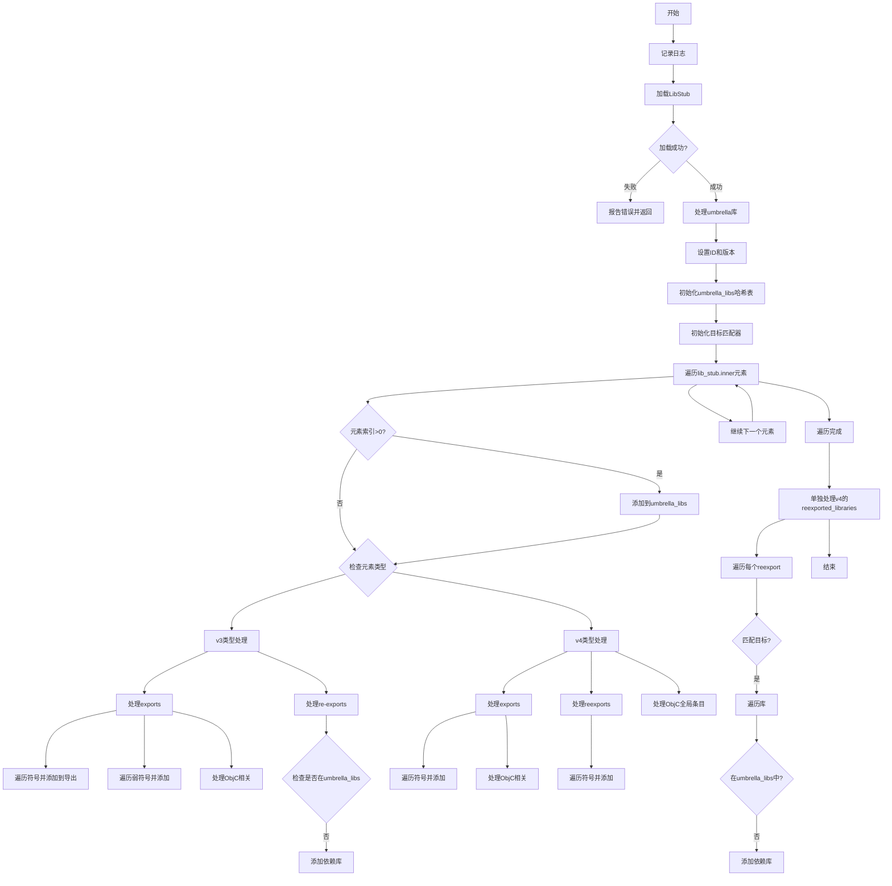

好的，我现在需要根据用户提供的Zig函数代码，用Mermaid画出它的流程图。首先，我需要仔细阅读并理解这段代码的功能和结构。

这个函数名为`parseTbd`，属于`Dylib`结构体的方法。它接受一个`MachO`文件的指针，并返回一个错误联合类型。看起来这个函数的作用是解析TBD（Text-Based Dynamic Library Stub）文件，提取其中的导出符号、依赖库等信息。

让我先理清函数的整体流程：

1. **初始化和日志记录**：使用tracy进行跟踪，记录开始解析的日志。
2. **加载LibStub**：从文件句柄中加载LibStub，处理可能的错误。
3. **处理umbrella库**：获取第一个内部库作为umbrella，设置ID（包括当前版本和兼容版本）。
4. **初始化辅助结构**：创建umbrella_libs的哈希表，用于后续的依赖检查。
5. **目标匹配器设置**：根据CPU架构和平台初始化目标匹配器。
6. **遍历LibStub的内部元素**：
   - 对每个元素检查是否匹配目标。
   - 处理v3和v4两种不同的stub版本，提取导出符号、弱符号、ObjC类、实例变量、异常类型等。
   - 处理re-exports，将依赖库添加到dependents列表中。
7. **单独处理v4的reexported_libraries**：再次遍历，添加未被umbrella包含的依赖库。

接下来，我需要将这些步骤转化为流程图的结构。流程图的每个步骤应该对应代码中的关键操作，包括条件判断、循环等控制结构。

需要注意的是，代码中有多个循环和条件分支，例如对`lib_stub.inner`的遍历，每个元素可能是v3或v4类型，内部还有各种条件判断（如是否匹配arch/target，是否有exports等）。同时，处理v4的reexported_libraries是在一个单独的循环中进行的。

可能的挑战是如何清晰地表达这些嵌套的循环和条件分支，而不会让流程图变得过于复杂。可能需要分层，将主要步骤作为主流程，然后将内部处理作为子流程或使用子图。

另外，错误处理部分（如`catch`和`try`）也需要在流程图中体现，例如加载LibStub失败时报告错误并返回错误。

现在，我需要将这些步骤转化为Mermaid的语法。Mermaid的流程图语法支持节点、箭头、条件判断（菱形框）、循环等结构。需要合理组织这些元素，确保逻辑正确且易于理解。

可能的流程节点包括：

- 开始
- 记录日志
- 加载LibStub
- 处理umbrella库
- 初始化哈希表和匹配器
- 遍历每个内部元素
  - 检查是否匹配目标
  - 处理v3的exports、re-exports等
  - 处理v4的exports、reexports等
- 单独处理v4的reexported_libraries
- 结束

对于每个条件判断（如`if (stub_index > 0)`，`if (umbrella_libs.contains(lib))`等），需要相应的菱形分支。循环结构可以用循环框或通过连接线表示。

需要确保所有可能的路径都被覆盖，包括错误路径（如加载失败时直接返回错误）。

最后，检查流程图的正确性，确保没有遗漏关键步骤，逻辑顺序正确。
================================================

该流程图描述了函数的主要执行步骤：
1. 初始化阶段包括日志记录、加载库文件和错误处理
2. 核心处理阶段遍历库存根元素，根据版本类型(v3/v4)分别处理导出项和依赖项
3. 后处理阶段单独处理v4的库重导出项
4. 使用条件判断处理不同版本格式和依赖关系检查
5. 循环结构表示对多个元素的迭代处理

每个菱形节点表示条件判断，矩形节点表示处理步骤，箭头表示流程方向。通过分层结构展示了复杂的嵌套循环和条件分支关系。