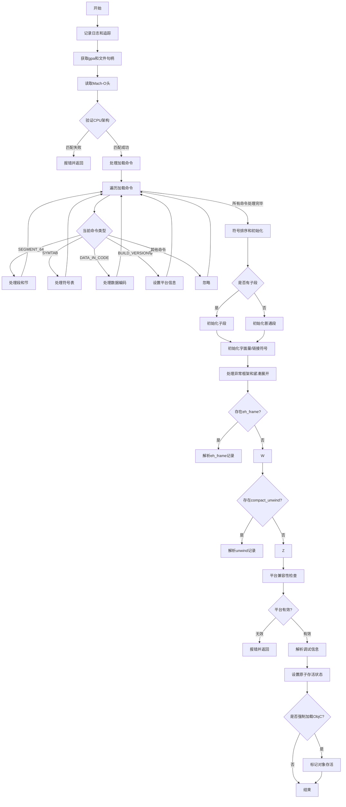

嗯，我现在需要为这个Zig函数画一个流程图。首先，我得仔细看看这个函数的结构。这个函数是`parse`方法，属于`Object`结构体，处理Mach-O文件的解析。让我一步一步理清楚。

首先，函数开始部分有一些日志和追踪的操作，比如`tracy`的跟踪和日志记录。接着，获取了gpa（通用分配器）和文件句柄，然后检查CPU架构是否匹配。这部分可能需要作为流程图的起始步骤。

接下来，函数读取Mach-O头，并进行验证。如果头部的CPU类型与目标不一致，就会报错。这里可能需要一个条件判断，根据不同的CPU类型分支。

然后处理加载命令（Load Commands），使用迭代器遍历每个命令。不同的命令类型有不同的处理方式，比如SEGMENT_64处理段和节，SYMTAB处理符号表，DATA_IN_CODE处理数据等。这部分可能会有多个分支，每个命令类型对应不同的处理块。

处理完加载命令后，对符号表中的符号进行排序和分类。这里涉及到排序逻辑，可能需要一个排序的步骤，并可能根据条件初始化子段或普通段。

之后，初始化各种字面量（cstring、固定大小、指针等），链接符号到原子（atom），排序原子，初始化符号和重定位信息。这部分可能是一系列的步骤，按顺序执行。

然后是处理异常处理框架（eh_frame）和紧凑展开（compact_unwind）的部分，如果有的话。这也可能涉及条件判断，检查是否有这些节存在。

接着检查平台兼容性，处理调试信息，并根据条件设置原子的存活状态。最后，检查是否需要强制加载Objective-C相关内容，决定对象是否存活。

现在，我需要将这些步骤转化为流程图中的各个节点和判断。可能的判断点包括：CPU架构是否匹配、不同的加载命令类型、是否有eh_frame或compact_unwind节、平台是否有效等。

需要注意的是，有些步骤是顺序执行的，而有些是基于条件分支的。例如，处理加载命令时，每个命令类型可能对应不同的处理分支。此外，初始化子段或普通段也是一个条件分支。

可能的结构：

1. 开始 -> 日志和初始化
2. 读取Mach-O头 -> 验证CPU架构（条件判断）
   - 如果错误，报错并结束
3. 处理加载命令（循环每个命令）
   - 根据不同命令类型分支处理
4. 符号排序和初始化子段/段
5. 初始化字面量、链接符号、排序原子等后续步骤
6. 处理异常处理框架和紧凑展开（条件判断是否存在）
7. 平台检查（条件判断是否匹配）
8. 处理调试信息
9. 设置原子的存活状态
10. 检查强制加载ObjC，设置alive标志
11. 结束

在绘制流程图时，循环处理加载命令可能需要一个循环结构，每个迭代处理一个命令，并根据命令类型分支处理。另外，条件判断需要用菱形框表示，不同的处理步骤用矩形框，箭头表示流程方向。

可能忽略了一些细节，比如错误处理（如返回错误的地方），但为了简化，可能主要关注主流程，错误处理作为终止节点。

需要确保每个步骤之间的顺序正确，条件分支合理。可能还需要合并一些步骤，比如初始化各种字面量可以合并为一个步骤，除非它们之间有依赖关系。

总之，流程图需要清晰展示函数的主要步骤和分支，帮助理解整个解析过程。
================================================

该流程图展示了`Object.parse`函数的核心逻辑流程，包含以下关键步骤：

1. **初始化和验证阶段**
   - 日志记录和性能追踪
   - 读取Mach-O头并进行CPU架构校验
   - 加载命令的迭代处理（支持SEGMENT_64/SYMTAB/DATA_IN_CODE等核心命令）

2. **符号处理阶段**
   - 符号表排序和分类
   - 根据条件初始化子段或普通段
   - 各类字面量的初始化

3. **异常处理阶段**
   - 对__eh_frame和__compact_unwind特殊段的解析
   - 平台兼容性验证

4. **收尾阶段**
   - 调试信息解析
   - 原子的存活状态控制
   - 强制加载ObjC的逻辑判断

菱形节点表示条件分支，矩形节点表示处理步骤，箭头方向指示程序流走向。错误路径直接终止流程，主成功路径最终汇聚到结束节点。