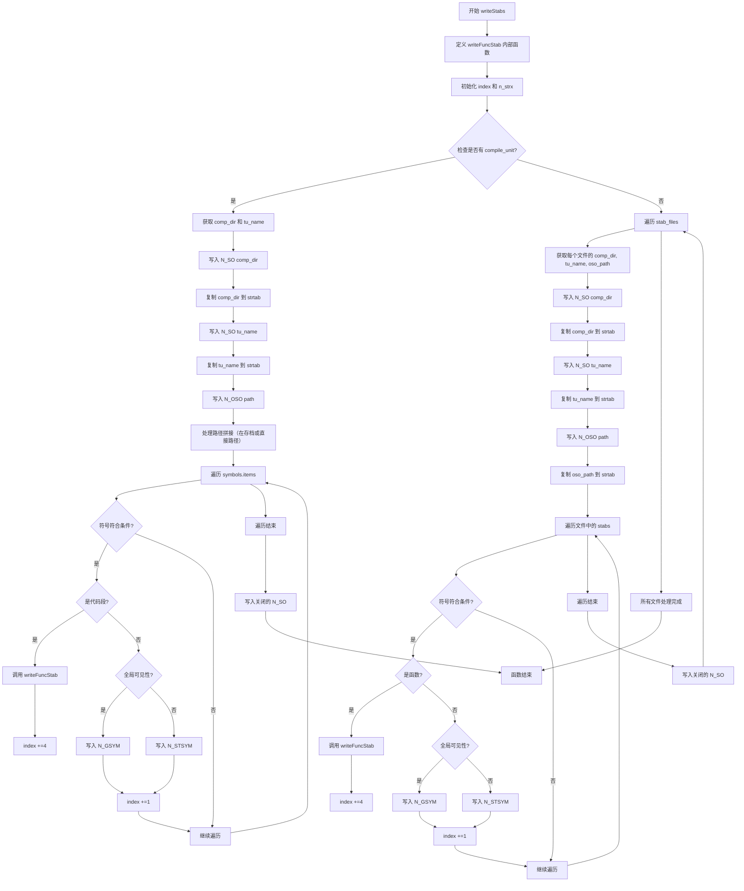

好，我现在需要为给定的Zig函数`writeStabs`绘制流程图。首先，我需要理解这个函数的功能和结构。看起来这个函数是用于写入Mach-O文件的符号表（stabs）信息的。

首先，函数定义了一个内部函数`writeFuncStab`，用来写入函数符号的stab条目。然后，函数处理`compile_unit`的情况，如果有的话，写入N_SO和N_OSO条目，处理符号，然后关闭作用域。如果`compile_unit`不存在，则处理`stab_files`中的每个文件，同样写入各种符号信息，并关闭作用域。

接下来，我需要将这个过程分解成流程图中的各个步骤。流程图应该包括开始、条件判断、循环、函数调用以及结束等节点。

可能的步骤包括：
1. 开始函数。
2. 定义writeFuncStab内部函数。
3. 初始化index和n_strx变量。
4. 检查是否存在compile_unit。
   - 如果存在：
     a. 获取comp_dir和tu_name。
     b. 写入N_SO条目。
     c. 复制字符串到strtab。
     d. 写入N_OSO条目。
     e. 处理符号表中的每个符号，根据类型写入不同的stab条目。
     f. 写入关闭的N_SO条目。
   - 如果不存在：
     a. 遍历每个stab_files。
     b. 对于每个文件，写入N_SO、N_SO、N_OSO条目。
     c. 处理该文件中的每个stab，调用writeFuncStab或写入其他类型条目。
     d. 写入关闭的N_SO条目。
5. 结束函数。

需要注意条件分支和循环的处理，例如`if (self.compile_unit)`和`for (self.symbols.items, 0..)`等部分。另外，函数中的`writeFuncStab`调用和不同符号类型的处理需要明确在流程图中表示。

可能需要使用不同的形状，如矩形表示步骤，菱形表示条件判断，循环使用带有循环标记的框等。此外，确保流程图的连贯性，每个步骤之间的箭头正确指向。

最后，根据这些步骤，用Mermaid语法绘制出结构清晰的流程图。
================================================
