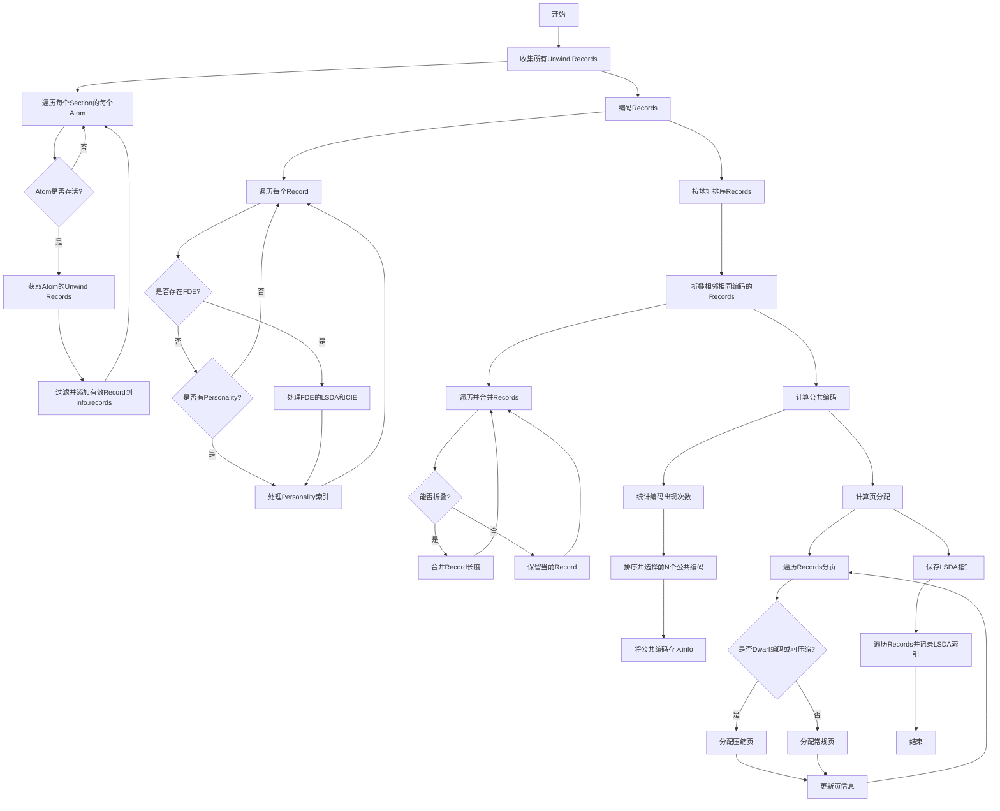

嗯，我需要为这个用Zig写的函数生成一个Mermaid流程图。首先，我得仔细读一遍代码，理解每个步骤在做什么。函数的名字是generate，属于UnwindInfo模块，处理Mach-O文件的展开信息。

首先，函数开始收集所有的unwind records。遍历每个section的每个atom，检查atom是否存活，获取它们的unwind records，并将有效的记录添加到info.records里。这部分可能需要一个循环结构来表示。

然后是编码记录的部分。对每个记录进行处理，处理FDE（Frame Description Entry）、LSDA（Language Specific Data Area）、CIE（Common Information Entry）等。这里涉及到条件判断，比如是否存在FDE，是否有LSDA，是否有个性化函数等。这些判断应该用条件分支来表示。

接下来是排序阶段，根据输出section内的相对地址排序记录。这里使用了一个自定义的排序函数sortFn，可能需要一个排序步骤的节点。

之后是折叠记录，相邻的相同编码的记录合并。这部分有一个循环，可能需要一个循环结构，检查是否可以折叠，然后进行合并或保留。

记录处理完后，计算公共编码。这里统计每种编码的出现次数，排序后选择前几个作为公共编码。这部分涉及到集合操作和排序，可能需要一个统计和筛选的过程。

然后是计算页分配，根据不同的条件将记录分页，分为常规页和压缩页。这部分比较复杂，需要处理多个条件，比如是否属于Dwarf、是否有足够的空间、编码类型等。可能需要一个循环，分页处理，并记录每页的信息。

最后是保存有LSDA指针的记录，并记录它们的索引。这部分需要遍历所有记录，检查是否有LSDA，并添加到相应的列表中。

在画流程图的时候，需要把这些步骤按顺序排列，每个步骤中的循环和条件分支用相应的Mermaid语法表示。比如使用菱形表示条件判断，矩形表示处理步骤，箭头连接各个步骤。

需要注意的是，有些步骤之间有依赖关系，比如排序必须在折叠之前，计算公共编码必须在页分配之前。需要确保流程的顺序正确。

另外，代码中有一些日志输出和错误处理（比如try），但在流程图中可能不需要详细表示这些，主要关注主流程即可。

可能还需要将一些复杂的步骤分解成子流程，比如编码记录部分可能有多个条件分支，需要详细展开。

最后，确保流程图的每个节点都对应代码中的一个关键步骤，结构清晰，逻辑正确。
================================================
