好的，我现在需要为给定的Zig函数`flushStaticLib`绘制一个Mermaid流程图。首先，我需要理解这个函数的结构和逻辑流程。

首先，函数`flushStaticLib`接收三个参数：`macho_file`、`comp`和`module_obj_path`。它的主要功能似乎是处理并生成一个静态库（可能是Mach-O格式的）。

让我逐步分析函数的步骤：

1. **初始化阶段**：
   - 获取`gpa`（通用分配器）和`diags`（诊断信息）。
   - 创建一个`positionals`数组来存储链接输入，并将`comp.link_inputs`添加进去。
   - 遍历`comp.c_object_table`的键，将每个成功生成的对象路径添加到`positionals`中。
   - 如果存在`module_obj_path`，也将其添加到`positionals`。
   - 根据`comp.compiler_rt_strat`和`comp.ubsan_rt_strat`的配置，添加对应的运行时对象。

2. **处理输入文件**：
   - 对每个`positionals`中的链接输入进行分类，处理可能的错误并记录到`diags`。
   - 检查是否有错误，如果有则返回错误。

3. **解析输入文件**：
   - 调用`parseInputFilesAr`解析AR格式的输入文件。
   - 再次检查错误。

4. **处理Zig对象**：
   - 如果存在Zig对象（`getZigObject`），则进行一系列操作：解析符号、标记导出、处理未解决的引用、排序段、添加原子到段、计算段大小、创建段、分配段和段内部分配。
   - 写入段内容，排序重定位项，将段内容写入文件。
   - 对特定的Zig段名进行清理（`sanitizeZigSections`）。
   - 写入加载命令和头文件。

5. **处理归档文件**：
   - 收集所有文件索引（包括Zig对象和其他对象）。
   - 初始化`ar_symtab`（归档符号表），更新每个文件的符号表。
   - 排序符号表。
   - 更新每个文件的大小，计算归档的总大小。
   - 为每个文件分配文件偏移量。

6. **写入归档文件**：
   - 写入归档的魔数（ARMAG）。
   - 写入符号表。
   - 对齐并写入每个对象文件的内容到缓冲区。
   - 确保缓冲区大小与总大小一致，并将内容写入文件。

在整个过程中，需要注意错误处理，任何步骤出错都会通过`diags`记录，并最终返回`error.LinkFailure`。

接下来，我需要将这些步骤转化为Mermaid流程图。由于函数较长，流程图需要分块处理，可能包括主要流程块，如初始化、处理输入、处理Zig对象、处理归档文件、写入归档等。每个块内部可能有子步骤，需要注意条件判断（如是否存在Zig对象，是否有错误发生）和循环（如遍历输入文件）。

可能遇到的挑战是如何在流程图中简洁地表示复杂的逻辑分支和循环，同时保持可读性。需要合理分组步骤，使用子图（subgraph）来组织代码块，并使用条件判断节点（如菱形判断框）表示错误检查。

此外，需要注意函数中的错误处理逻辑，如`diags.hasErrors()`检查，这在流程图中需要用条件分支表示。

最后，确保流程图的顺序正确，各步骤之间的依赖关系清晰。
================================================

```mermaid
flowchart TD
    A[开始] --> B[初始化]
    B --> C[收集链接输入]
    C --> D[添加C对象文件]
    D --> E[添加模块对象文件]
    E --> F[添加编译器运行时]
    F --> G[添加UBSAN运行时]
    G --> H[分类输入文件]
    H --> I{是否有错误?}
    I -->|是| J[返回LinkFailure]
    I -->|否| K[解析AR输入文件]
    K --> L{是否有错误?}
    L -->|是| J
    L -->|否| M{存在Zig对象?}
    M -->|是| N[处理Zig对象]
    N --> O[解析符号]
    O --> P[标记导出]
    P --> Q[处理未解决的引用]
    Q --> R[排序段]
    R --> S[添加原子到段]
    S --> T[计算段大小]
    T --> U[创建段]
    U --> V[分配段]
    V --> W[写入段内容]
    W --> X[排序重定位]
    X --> Y[写入文件]
    Y --> Z[清理段名]
    Z --> AA[写入加载命令和头文件]
    M -->|否| AB[收集文件索引]
    AA --> AB
    AB --> AC[初始化ar_symtab]
    AC --> AD[更新符号表]
    AD --> AE[排序符号表]
    AE --> AF[更新文件大小]
    AF --> AG[计算总大小]
    AG --> AH[分配文件偏移]
    AH --> AI[写入归档魔数]
    AI --> AJ[写入符号表]
    AJ --> AK[写入对象文件]
    AK --> AL[对齐和填充]
    AL --> AM[写入文件内容]
    AM --> AN[验证缓冲区大小]
    AN --> AO[写入最终文件]
    AO --> AP{是否有错误?}
    AP -->|是| J
    AP -->|否| AQ[结束]
    J --> AQ
``` 

该流程图展示了`flushStaticLib`函数的主要流程，包括初始化、输入收集、对象处理、符号表操作和归档文件生成。菱形节点表示条件判断，矩形节点表示操作步骤，箭头表示流程方向。