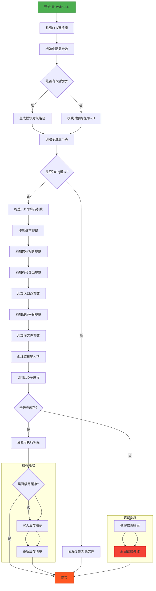

嗯，我需要帮用户将提供的 Zig 函数 `linkWithLLD` 用 Mermaid 画出流程图。首先，我要理解这个函数的结构和逻辑流程。这个函数主要负责使用 LLD 链接器来链接 WebAssembly 模块。看起来里面有很多条件判断和错误处理，还有一些文件操作和子进程的调用。

首先，我应该通读整个函数，确定主要的步骤。函数开始部分检查 LLD 链接器，然后处理一些配置参数，比如目标平台、输出路径等。接着根据是否有 Zig 代码来编译模块对象文件。之后，处理缓存相关的逻辑，生成哈希摘要，检查是否需要重新链接。如果缓存命中，就直接返回；否则继续执行链接步骤。

然后，函数分为两种情况：生成目标文件（Obj）还是其他输出模式。如果是 Obj，直接复制对象文件；否则构造 LLD 的命令行参数，调用 LLD 进行链接。这部分包括处理各种链接选项，如内存设置、导出符号、入口点等。最后处理子进程的输出和错误，设置文件权限，更新缓存。

在画流程图时，需要将这些步骤分解成不同的节点，并用箭头表示流程。注意条件判断（如 if 语句）会导致分支，需要用菱形表示判断节点。每个主要操作（如生成哈希、调用 LLD）作为矩形节点。错误处理和返回路径也需要考虑进去。

可能的遗漏点：某些条件分支可能被忽略，比如不同的输出模式（Exe、Lib）或不同的操作系统处理（WASI）。此外，子进程调用的成功与失败处理也需要体现在流程图中。缓存处理部分可能需要单独的流程分支，特别是哈希生成和检查是否匹配。

需要确保流程图覆盖所有主要路径，包括错误处理和提前返回的情况。同时，保持结构清晰，避免过于复杂，可能需要将某些子流程合并或简化。
================================================
