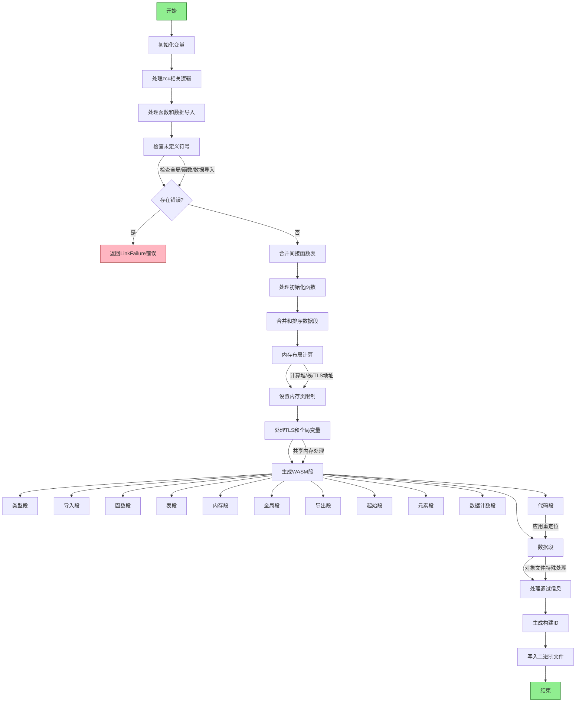

好的，我需要根据提供的 Zig 代码绘制一个函数的流程图。首先，我需要理解这个函数的主要逻辑和各个步骤。函数名为 `finish`，属于 `Flush` 结构体的方法，接受 `*Flush` 和 `*Wasm` 作为参数，返回 `void` 或错误。

首先，函数开始处初始化了一些变量，如 `comp`、`shared_memory`、`diags` 等。接着处理与 `zcu` 相关的逻辑，包括检测内联函数和处理标签名称。然后处理函数和数据的导入，检查未定义的符号，并处理错误情况。

接下来，合并间接函数表，处理初始化函数，合并和排序数据段，处理内存布局，包括堆栈、堆和 TLS 的地址分配。然后处理内存的初始化和最大限制设置。

之后，生成 WebAssembly 的各个部分，如类型段、导入段、函数段、表段、内存段、全局段、导出段、起始段、元素段、数据计数段、代码段和数据段。最后处理调试信息和构建 ID，并将生成的二进制内容写入文件。

在绘制流程图时，需要将这些步骤分解为不同的节点，并用箭头表示流程。需要注意的是条件判断和循环结构，例如处理导入时的循环检查，合并数据段时的排序逻辑，以及不同配置（如是否为对象文件）下的不同处理路径。

可能遇到的困难包括理解某些复杂的数据结构（如 `f.data_segments` 和 `wasm.functions` 的处理），以及处理错误和条件分支的逻辑。需要确保每个步骤都被正确表示，并且条件分支（如 `if (is_obj)`）在流程图中清晰显示。

另外，生成 WebAssembly 段的部分需要详细分解，确保每个段（如类型段、导入段等）的生成步骤都包含在流程图中。对于每个段，可能需要说明其内容是如何被收集和写入的。

最后，处理调试信息和构建 ID 的部分可能需要单独的子流程，特别是不同构建模式下的处理差异。

总结来说，流程图的大致结构如下：
1. 初始化和变量设置
2. 处理 zcu 相关的逻辑
3. 处理导入和检查未定义符号
4. 合并间接函数表和初始化函数
5. 处理数据段和内存布局
6. 生成各个 WebAssembly 段
7. 处理调试信息和构建 ID
8. 写入最终二进制文件

在绘制时，每个主要步骤作为一个节点，条件判断使用菱形框，循环结构用箭头和循环标记表示。需要确保所有错误处理路径也被包含，例如在发现未定义符号时返回错误。
================================================

关键节点说明：
1. **内存布局计算**：包含堆栈地址对齐、TLS区域分配和虚拟地址映射
2. **WASM段生成**：涵盖标准WebAssembly模块所有必要段的构造
3. **重定位处理**：在代码段和数据段应用地址修正
4. **调试信息**：包含producer信息、特征标记和build ID生成
5. **错误处理**：贯穿全流程的严格符号检查和内存对齐验证

该流程图展示了从初始化到最终二进制生成的全过程，重点突出了模块化分段生成结构和严格的错误检查机制。黄色节点表示正常流程，红色节点表示错误出口，绿色节点表示流程起止。