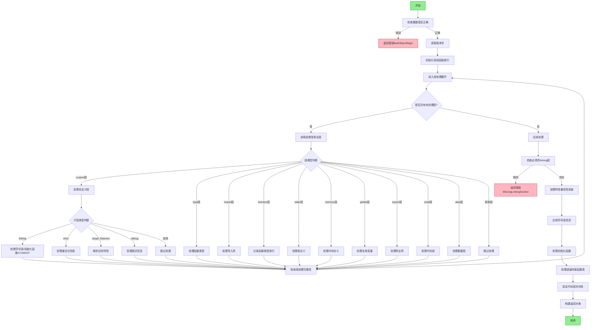

好的，我需要帮用户用Mermaid画出一个Zig函数的流程图。这个函数是`parse`，看起来是处理WebAssembly（Wasm）对象的解析。首先，我需要理解这个函数的主要步骤和逻辑结构。

首先，函数开始检查文件的魔数是否正确，验证是否是有效的Wasm文件。接着读取版本号。然后初始化各种段的起始索引，比如数据段、自定义段、函数、表、内存等。之后进入一个循环处理各个段（section）。

在处理每个段时，根据段的类型进行不同的操作。例如，处理自定义段时，可能遇到“linking”子段，里面包含符号表、初始化函数等信息。还有可能处理重定位段（reloc）、目标特性（target_features）等。对于每个段，函数会读取相应的数据，填充到Wasm对象的结构中。

在处理符号表时，根据符号的类型（数据、函数、全局变量等）进行不同的处理，并处理导入和导出。之后，应用符号表信息到各个对象，比如函数、全局变量等。最后进行各种验证，比如检查TLS段是否需要特定的CPU特性，处理特性兼容性，处理遗留的间接函数表等。

接下来，我需要将这些步骤转化为流程图。流程图应该包括开始、主要处理步骤、条件判断、循环处理各个段，以及错误处理和结束。

需要注意的点：
1. 初始检查和读取版本号。
2. 初始化各个段的起始索引。
3. 循环处理每个段，根据段类型分支处理。
4. 处理不同类型的段，如custom、type、import、function等。
5. 处理符号表和重定位信息。
6. 应用符号表信息到对象结构。
7. 最后的验证和错误检查。
8. 返回结果。

可能需要将循环处理段的部分展开，展示主要的处理分支，比如custom段中的linking、reloc、target_features等。每个分支内的处理步骤可以适当简化，避免流程图过于复杂。

此外，错误处理的部分需要标注可能的错误路径，比如魔数错误、版本不支持、缺少必要段等。

最后，整理这些步骤，用Mermaid的语法绘制流程图，确保逻辑清晰，步骤连贯。
================================================
