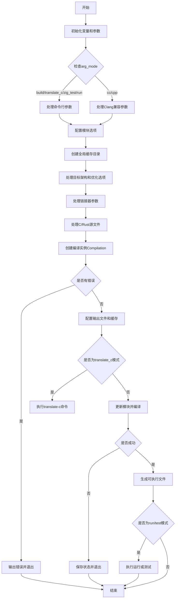

好的，我需要分析用户提供的Zig代码中的`buildOutputType`函数，并为其绘制流程图。首先，我会尝试理解这个函数的结构和主要步骤。

首先，这个函数似乎负责处理构建输出的类型，解析命令行参数，配置编译选项，并最终执行构建或运行操作。函数内部有很多变量声明，处理不同的编译选项，比如目标架构、优化级别、链接选项等。

接下来，我需要识别函数的主要流程。函数开始时声明了很多变量，然后进入一个大的switch语句，根据`arg_mode`的不同（如build、translate_c、zig_test、run等）处理不同的参数。接着，处理各种命令行选项，设置模块选项，配置链接器参数，处理C源文件等。

然后，函数会创建编译实例（`Compilation.create`），配置各种编译选项，处理缓存目录，设置线程池，处理输出文件的位置等。最后，根据不同的模式（如运行、测试）执行相应的操作。

在绘制流程图时，需要将整个流程分解为几个主要步骤：
1. 初始化变量和解析参数。
2. 根据不同的`arg_mode`处理对应的逻辑。
3. 配置模块选项和链接器参数。
4. 创建编译实例并配置编译选项。
5. 处理输出文件和缓存。
6. 执行构建或运行命令。

需要注意的是，函数中有很多条件分支和错误处理，这些需要在流程图中体现出来。例如，处理不同的命令行参数选项时，可能会有不同的路径；创建编译实例时，可能会遇到错误，需要处理错误并退出。

另外，流程图中需要展示主要的函数调用和关键决策点，比如根据`arg_mode`选择不同的处理逻辑，处理不同的编译选项（如优化级别、目标架构），以及最终执行构建或测试的步骤。

最后，需要确保流程图的逻辑清晰，步骤之间的转换正确，覆盖函数的主要路径和重要分支。
================================================

流程说明：
1. 初始化阶段处理环境变量和基本参数
2. 根据arg_mode进入不同参数处理分支
3. 配置模块选项时处理-M参数和依赖关系
4. 创建全局缓存目录和本地缓存目录
5. 处理目标架构、CPU特性等平台相关配置
6. 配置链接器参数包括动态库、框架路径等
7. 处理C/RC源文件和资源文件
8. 创建Compilation实例时整合所有配置
9. 根据编译模式进行不同输出处理
10. 最终根据模式决定是否执行程序或测试
11. 错误处理贯穿整个流程，失败时保存增量编译状态
12. 资源清理阶段关闭所有打开的文件描述符和缓存目录