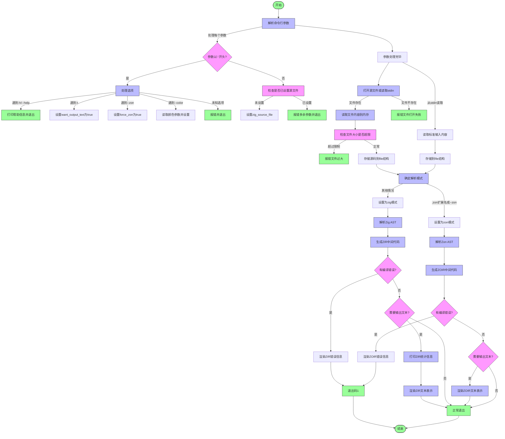

好的，我现在需要为提供的Zig函数`cmdAstCheck`绘制一个流程图。首先，我需要仔细阅读并理解这段代码的功能和结构。

首先，函数`cmdAstCheck`接受三个参数：两个分配器`gpa`和`arena`，以及一个字符串数组`args`。它返回一个可能的错误或`void`。看起来这是一个处理AST（抽象语法树）检查的命令行工具。

接下来，函数内部定义了一些变量，如`color`、`want_output_text`、`force_zon`和`zig_source_file`。然后通过一个`while`循环处理命令行参数`args`，解析各种选项，比如`--help`、`-t`、`--zon`、`--color`等。这里需要注意到参数解析的逻辑，包括错误处理，例如当`--color`后面没有参数时的致命错误。

处理完参数后，函数尝试打开并读取输入的Zig源文件或从标准输入读取内容。根据文件名是否以`.zon`结尾或是否强制使用`--zon`选项，确定解析模式（`mode`）是`.zon`还是`.zig`。

接下来，根据不同的模式（`.zig`或`.zon`），生成对应的中间表示（ZIR或ZOIR），并进行错误检查。如果存在编译错误，会输出错误信息并退出。如果用户要求输出文本（`-t`选项），则会打印相关的统计信息，并渲染中间表示的内容。

在绘制流程图时，需要将整个过程分解为几个主要步骤：

1. **参数解析**：处理命令行参数，设置相应的标志和选项。
2. **文件处理**：确定输入源（文件或标准输入），读取内容。
3. **模式确定**：根据文件扩展名或选项决定使用`.zig`还是`.zon`模式。
4. **解析与生成中间表示**：生成ZIR或ZOIR，检查错误。
5. **错误处理与输出**：如果有错误，渲染错误信息；如果指定了文本输出，打印统计信息和中间表示。

需要注意各个步骤之间的条件分支，例如参数解析中的不同选项处理，模式选择的条件，以及错误处理的不同路径。此外，函数中有多处错误处理和提前退出的情况，如`fatal`调用和`process.exit`，这些也需要在流程图中体现。

在绘制过程中，可能需要使用判断节点（菱形）来表示条件分支，如参数是否以`-`开头、文件是否存在、是否启用调试扩展等。每个处理步骤用矩形框表示，开始和结束用圆角矩形。错误处理和退出流程需要用单独的路径表示。

需要确保流程图的逻辑与代码结构一致，特别是循环和条件判断的嵌套关系。同时，注意代码中的`defer`语句，确保资源释放的流程正确，但流程图可能不需要详细展示这些细节，除非对理解主流程有帮助。

最后，根据代码中的不同模式（`.zig`和`.zon`），流程图需要分支出不同的处理路径，包括生成不同的中间表示、错误检查方式以及输出内容的不同。
================================================
