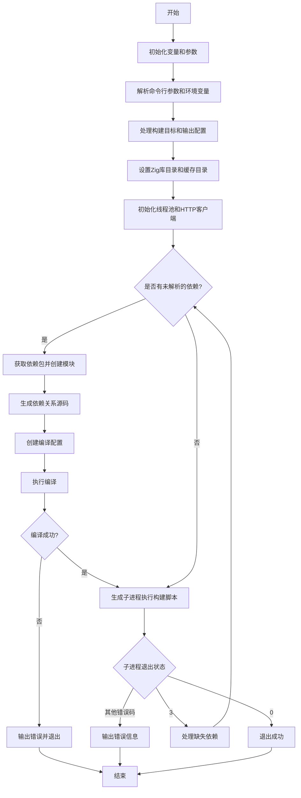

好的，我现在要分析用户提供的Zig代码中的`cmdBuild`函数，并尝试用Mermaid画出它的流程图。首先，我需要理解这个函数的功能和结构。

首先，这个函数名为`cmdBuild`，看起来是处理构建命令的。它接收三个参数：两个分配器（`gpa`和`arena`）和一个字符串数组`args`。返回类型是`!void`，表示可能抛出错误。

函数开头调用`dev.check(.build_command);`，可能是检查构建命令是否有效。接下来声明了很多变量，比如`build_file`、各种目录路径（如`override_lib_dir`）、子进程的参数列表`child_argv`，以及一些调试和日志相关的标志变量（如`verbose_link`、`verbose_cc`等）。

然后，初始化`child_argv`，添加了一些参数，包括Zig可执行文件的路径、库目录、构建文件路径、缓存目录等。这里还生成一个随机种子，并处理了一些环境变量和命令行参数。

接下来有一个循环处理`args`参数，解析各种命令行选项，比如`--build-file`、`--zig-lib-dir`、`--cache-dir`等，并将它们添加到`child_argv`中。这些选项可能影响构建过程，如指定构建文件的位置、库目录、缓存目录等。

然后，处理构建目标，根据是否启用调试扩展来决定目标平台。接着生成构建脚本的可执行文件名，并设置输出位置。

之后，处理Zig库目录、全局和本地缓存目录，确保这些目录存在并可访问。还初始化了一个线程池，用于并行处理任务。

接下来，进入一个无限循环，处理构建过程中的依赖项获取。这里涉及到HTTP客户端（如果支持的话）、包管理、模块创建等。如果检测到缺少依赖项，会尝试重新获取，直到所有依赖满足为止。

然后，创建编译配置（`Compilation`），设置各种编译选项，并执行编译。如果编译失败，会输出错误信息并退出。

最后，生成子进程执行构建脚本，处理子进程的输出和退出状态。如果子进程返回特定状态码（如3），表示需要处理缺少的依赖项，此时会重新进入循环处理。

在流程图中，需要涵盖以下几个主要步骤：
1. 初始化变量和子进程参数。
2. 解析命令行参数和环境变量。
3. 处理构建目标和输出配置。
4. 检查并设置缓存目录。
5. 初始化线程池和HTTP客户端（如需要）。
6. 循环处理依赖项获取和模块创建。
7. 执行编译并处理编译结果。
8. 启动子进程执行构建脚本，处理子进程的输出和状态。

可能需要考虑条件分支，比如是否启用调试扩展、是否支持获取命令、子进程的不同退出状态处理等。此外，循环处理依赖项的部分可能需要多次迭代，直到所有依赖项满足为止。

在绘制流程图时，需要注意各个步骤之间的顺序和条件判断，使用Mermaid的语法正确表示流程的开始、结束、判断节点和循环结构。同时，需要将代码中的主要逻辑块转化为相应的流程节点，确保逻辑清晰。
================================================

### 流程说明：
1. **初始化阶段**  
   初始化命令行参数、环境变量、缓存路径，并准备子进程参数列表。
   
2. **参数解析**  
   处理`--build-file`、`--zig-lib-dir`等选项，配置构建目标和调试标志。

3. **目录和资源准备**  
   确保Zig库目录、全局/本地缓存目录可访问，初始化线程池和HTTP客户端（用于依赖下载）。

4. **依赖解析循环**  
   检查是否需要处理未解析的依赖项。若存在，通过HTTP客户端获取依赖包，生成模块源码。

5. **编译阶段**  
   创建编译配置（包含目标平台、模块依赖等），执行编译。若失败则直接退出。

6. **子进程执行**  
   生成子进程运行构建脚本。根据退出状态：
   - **0**: 成功退出。
   - **3**: 存在未解析的依赖，重新进入依赖解析循环。
   - **其他错误码**: 输出错误信息并终止。

7. **结束流程**  
   根据编译或子进程结果退出程序。