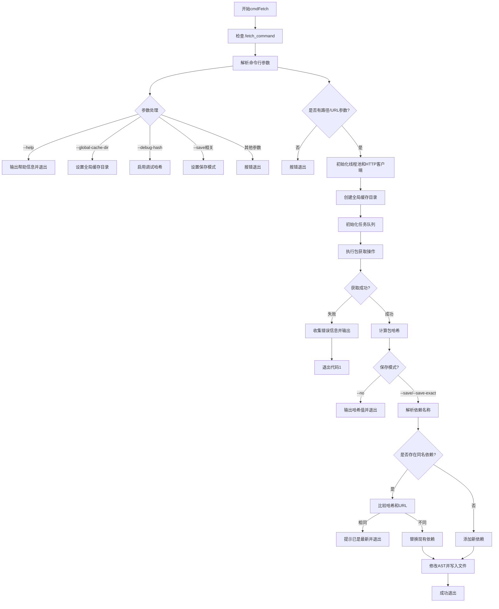

嗯，我需要为这个Zig函数`cmdFetch`画一个流程图。首先，我得仔细阅读代码，理解每个步骤的作用和逻辑流程。这个函数看起来是用来获取依赖项的，处理命令行参数，执行HTTP请求，管理缓存，保存依赖信息到构建文件中。

首先，函数开始时会检查是否是fetch命令。然后处理各种命令行参数，比如`--help`、`--global-cache-dir`、`--save`等。这一步需要根据不同的参数设置不同的变量，比如`override_global_cache_dir`、`debug_hash`、`save`模式等。

接下来，验证是否提供了路径或URL参数，如果没有会报错。然后初始化线程池和HTTP客户端，设置全局缓存目录。之后创建`job_queue`来处理包的获取任务，使用`Package.Fetch`结构体来管理获取过程，包括运行获取任务，处理错误等。

如果获取过程中出现错误，会通过错误包收集错误信息并输出到标准错误流。如果成功获取，会计算包的哈希值，并根据`save`模式决定是将哈希值输出到标准输出还是保存到`build.zig.zon`文件中。

在保存依赖信息时，需要处理不同的情况：覆盖现有依赖、添加新依赖到现有列表，或者首次创建依赖结构。这里涉及到修改AST（抽象语法树）并写入文件。

我需要将这些步骤转化为流程图中的各个节点和判断分支。可能的判断点包括参数解析时的不同选项、路径或URL是否存在、保存模式的选择、依赖是否已存在等。每个处理步骤需要对应流程图中的一个过程框，判断点对应菱形框，箭头表示流程方向。

需要注意的是，Zig的一些特性，比如错误处理（try/catch）、可选类型（`?`符号）、联合类型（`union(enum)`）等，可能会影响流程的分支。比如`save`变量是一个联合类型，不同的枚举值会影响后续的逻辑走向。

此外，文件操作、网络请求和并发处理（线程池）也是流程中的关键步骤，需要正确表示它们的顺序和可能的错误处理路径。例如，初始化HTTP客户端和线程池后，需要确保在函数退出前正确释放资源（defer语句）。

最后，流程图的结束部分应处理成功退出或错误退出的情况，比如通过`cleanExit()`或`process.exit(1)`。
================================================
