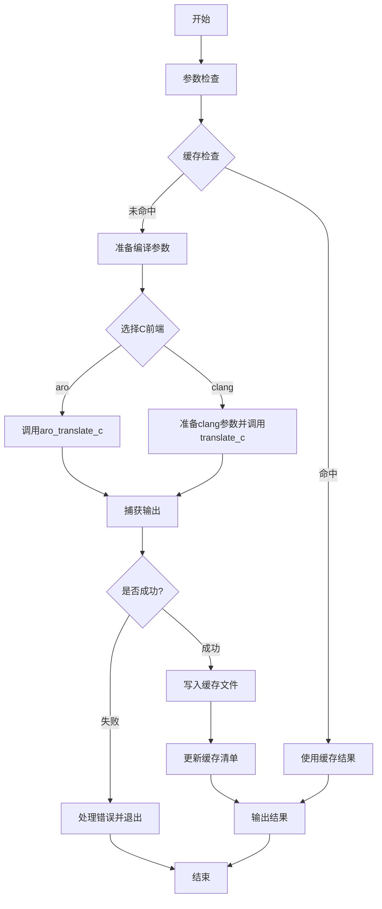

嗯，我现在需要根据提供的Zig代码绘制一个流程图。首先，我需要理解这个函数的主要流程。这个函数叫做cmdTranslateC，看起来是用来将C代码翻译成Zig代码的。

首先，函数开始处有一些参数检查，比如检查comp.c_source_files的长度是否为1，然后获取第一个C源文件。接着生成翻译后的Zig文件名，格式是{root_name}.zig。然后涉及到缓存的处理，使用Cache.Manifest来管理缓存。这里有一个随机的哈希值0xb945，可能是为了区分不同的编译步骤。

接下来，函数检查缓存是否命中。如果缓存命中，直接使用缓存中的结果，否则需要执行实际的翻译过程。这里分两种情况，使用不同的C前端（aro或clang）。对于clang前端，需要处理参数，生成临时目录，处理依赖文件等。然后调用相应的翻译工具，比如aro_translate_c或者clang的相关功能，生成Zig代码。

在翻译过程中，如果出现错误，会处理错误信息，可能输出到标准错误并退出。如果成功，生成的Zig代码会被写入缓存目录中的文件，并更新缓存清单。

最后，根据是否启用fancy_output，选择输出结果的方式，要么将生成的Zig文件内容输出到标准输出，要么保存相关信息。

在画流程图时，需要将这些主要步骤用流程图符号表示出来。比如开始和结束节点，判断缓存是否命中，处理不同前端的分支，错误处理，文件操作等。需要注意各个步骤之间的顺序和条件分支。

可能需要确认一些细节，比如缓存命中和未命中时的具体操作，错误处理流程，以及不同前端的处理方式是否有差异。另外，函数中的一些辅助函数或外部调用可能需要简化表示，比如dev.check、fatal、Compilation.dump_argv等，这些在流程图中可能不需要展开，只需作为步骤提及。

最后，确保流程图的逻辑连贯，涵盖所有主要路径，包括错误路径和正常路径。可能需要多次检查代码，确保没有遗漏关键步骤。
================================================
