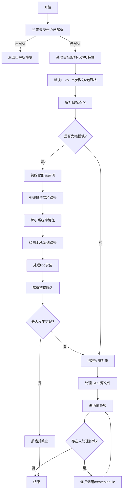

嗯，我现在需要理解这个用Zig写的createModule函数，并用Mermaid画出它的流程图。首先，我得仔细阅读代码，看看这个函数主要做了什么。函数名是createModule，应该和创建模块有关。参数里有Allocator、CreateModule结构体、索引、父模块等等，看起来是在构建模块的层次结构。

首先，函数开始处获取了cli_mod，检查是否已经解析过，如果已经解析就直接返回。然后是处理目标架构和系统相关的设置，比如target_arch_os_abi和target_mcpu。这里有很多条件判断，比如如果父模块存在，就继承父模块的目标设置，否则需要自己解析目标。

接下来，处理LLVM的-m参数，转换成Zig风格的CPU特性。这里用到了字符串处理，比如替换mno-前缀为减号，m前缀为加号。然后调用parseTargetQueryOrReportFatalError来解析目标查询，这可能涉及到错误处理，如果解析失败会报错。

然后，如果parent是null，说明这是根模块，需要初始化一些配置选项。这里涉及到链接库的处理，比如检查是否是libc、libc++，处理Windows的库，以及系统库路径的解析。这里有很多条件判断和循环，比如遍历cli_link_inputs，处理不同的链接输入类型。

之后，处理系统库路径，检查sysroot是否存在，解析库目录。如果是Darwin系统，还要处理框架路径。然后检测本地系统路径，处理libc的安装路径，解析链接输入，处理错误情况，比如找不到库或者路径错误。

最后，创建模块对象Package.Module，处理依赖关系，递归调用createModule创建子模块，并建立依赖关系。

画流程图的话，可能需要分成几个主要部分：

1. 初始化模块，检查是否已解析。
2. 处理目标架构和CPU特性。
3. 解析目标查询，获取目标信息。
4. 如果是根模块，初始化配置选项，处理链接库和路径。
5. 创建模块对象，处理C源文件和资源文件。
6. 递归处理依赖模块。

每个部分内部可能有条件判断和循环。比如在处理LLVM参数时，如果有参数需要处理，就进入转换流程；在解析目标时，可能需要处理不同的情况，如是否是本地系统等。

需要注意的是错误处理，比如fatal函数调用，会导致流程终止，这在流程图中可能需要用终止节点表示。递归处理依赖模块时，需要循环遍历所有依赖项，并为每个依赖项调用createModule。

可能的结构：

开始 -> 检查cli_mod是否已解析 -> 是的话返回
-> 处理目标设置 -> 解析目标查询 -> 如果是根模块，处理配置选项 -> 处理链接输入 -> 解析库路径 -> 检测本地路径 -> 处理libc安装 -> 解析链接输入 -> 处理错误 -> 创建模块 -> 处理源文件 -> 处理依赖 -> 递归调用createModule -> 结束

每个步骤中的条件分支需要详细标出，比如处理LLVM参数的条件，是否存在的判断，以及不同的处理路径。对于错误情况，需要连接到终止节点或错误处理流程。

可能还需要注意循环结构，比如遍历cli_link_inputs和处理依赖模块时的循环。

现在需要将这些步骤转化为Mermaid的流程图语法，使用合适的节点和连接线，处理条件分支和循环。
================================================

流程图说明：
1. 入口检查模块是否已缓存，直接返回已解析模块
2. 目标处理阶段转换LLVM参数并解析目标三元组
3. 根模块需要初始化编译配置，处理链接库路径和系统依赖
4. 创建模块对象后处理源代码文件归属
5. 递归处理所有子模块依赖，形成树状结构
6. 错误处理贯穿整个流程，遇到致命错误直接终止
7. 使用菱形节点表示条件判断，矩形节点表示处理步骤，圆角矩形表示流程终止