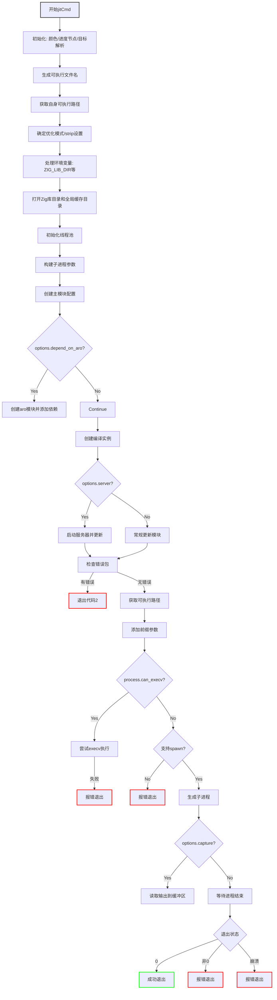

好的，我现在需要帮用户用Mermaid画出他们提供的Zig函数`jitCmd`的流程图。首先，我需要仔细阅读并理解这段代码的结构和逻辑。

首先，我会通读整个函数，了解各个部分的作用。函数`jitCmd`似乎负责处理某种即时编译命令，可能涉及编译配置、进程生成等。接下来，我需要识别函数中的主要步骤和分支。

函数开始时进行了一些初始化操作，比如设置颜色、根进度节点、解析目标配置、生成可执行文件名等。然后处理环境变量，如Zig库目录和全局缓存目录。接着初始化线程池，准备子进程的参数。中间部分涉及模块创建、编译配置、依赖处理（如`aro`模块），以及编译过程的创建和更新。最后，处理子进程的执行，包括错误处理、输出捕获和退出处理。

接下来，我需要将这些步骤分解成流程图中的各个节点，并确定它们之间的逻辑流向。例如，函数开始时的初始化步骤可能是一个顺序节点，然后根据条件（如`options.server`是否存在）分支到不同的处理路径。处理子进程的部分可能会有多个分支，如是否能执行execv、是否能生成子进程等，每个分支都有不同的结果。

需要注意的是，代码中有多个条件判断，如`if (options.depend_on_aro)`、`if (options.server)`、`if (process.can_execv)`等，这些都需要在流程图中体现为决策节点。此外，错误处理部分（如`fatal`调用）可能导致流程终止，这些也应该作为终止节点。

同时，函数中有一些资源管理操作，如打开和关闭目录句柄、初始化线程池后deinit等，这些可能在流程图中作为操作步骤，但可能不需要特别强调，除非它们影响主要流程。

最后，需要确保流程图的逻辑清晰，步骤之间的转换正确，特别是错误处理和退出路径。可能需要将主要的成功路径和错误路径分开表示，或者使用子流程来简化复杂的部分，比如编译配置的创建和模块的处理。

总结来说，流程图的大致结构可能如下：

1. 初始化和配置设置
2. 环境变量和目录处理
3. 线程池初始化
4. 构建子进程参数
5. 编译配置和模块创建
6. 处理依赖（如aro模块）
7. 编译过程创建和更新
8. 根据选项启动服务器或更新模块
9. 处理子进程执行（execv或spawn）
10. 处理子进程结果和退出

每个主要步骤中的条件分支需要正确表示，确保所有可能的路径都被覆盖。可能需要将较大的部分拆分为子流程，比如将编译过程创建作为子图，以保持主流程图的清晰。
================================================
