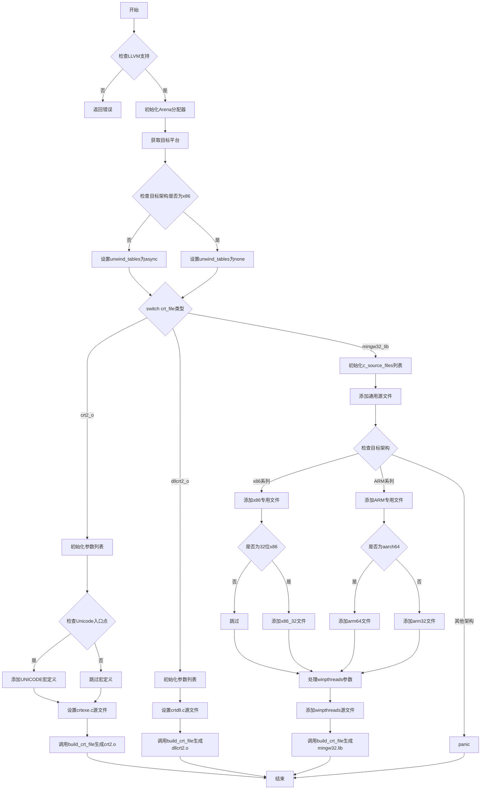

好的，我需要为给定的Zig函数绘制一个流程图。首先，我需要理解这个函数的结构和逻辑。

函数名为`buildCrtFile`，接受三个参数：`comp`、`crt_file`和`prog_node`。函数的主要作用是根据不同的`crt_file`类型构建不同的C运行时文件。

首先，函数检查是否启用了LLVM扩展，如果没有，则返回错误。接着，初始化一个Arena分配器，并获取目标平台信息。然后根据目标架构设置`unwind_tables`的值。

接下来是一个`switch`语句，根据`crt_file`的不同值执行不同的代码块：

1. **.crt2_o**：构建crt2.o文件，添加必要的编译参数，特别是处理Unicode入口点的情况。然后调用`build_crt_file`方法。

2. **.dllcrt2_o**：构建dllcrt2.o文件，流程与crt2.o类似，但使用不同的源文件。

3. **.mingw32_lib**：这部分更复杂，需要处理多个源文件，根据不同的CPU架构（x86、ARM等）添加对应的源文件。之后处理winpthreads相关的参数，并最终调用`build_crt_file`生成库文件。

需要注意每个分支中的细节，比如条件判断、循环添加源文件等。此外，错误处理（如`try`关键字）也需要在流程图中体现。

可能的遗漏点包括：
- 函数中使用的`addCrtCcArgs`和`addCcArgs`的具体内容，但流程图可能不需要深入这些函数内部。
- `build_crt_file`的具体实现，同样不需要展开。
- 某些条件判断的细节，如`comp.mingw_unicode_entry_point`的影响。

需要将这些逻辑步骤转化为流程图的节点和判断分支，确保每个条件分支清晰，并正确表示函数执行路径。

最后，使用Mermaid语法绘制流程图，确保节点和箭头正确反映函数逻辑。
================================================
