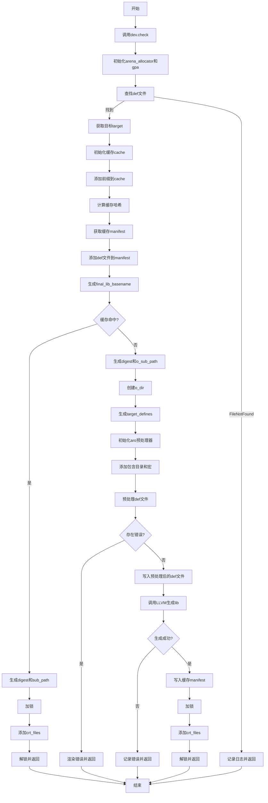

嗯，我现在需要帮用户用Mermaid画出一个Zig函数的流程图。这个函数是buildImportLib，看起来是处理构建导入库的。首先，我得理解这个函数的流程，然后把它转化为流程图的结构。

首先，函数开始于pub fn buildImportLib，然后调用了dev.check。接下来，初始化了gpa和arena_allocator，然后通过findDef寻找def文件。如果找不到，记录日志并返回；否则继续。接着获取目标target，初始化cache，添加各种前缀。然后处理缓存，生成最终的库文件名final_lib_basename。如果缓存命中，就直接使用缓存中的结果，否则继续处理。

接下来，处理def文件，生成目标定义target_defines，然后使用aro预处理器来处理宏和包含路径。如果有错误，渲染诊断信息并返回错误。之后将预处理后的token写入def_final_file。然后调用LLVM的WriteImportLibrary生成lib文件。最后处理缓存清单，并将结果存入comp.crt_files。

我需要把这些步骤分解成流程图的各个节点，包括条件判断（比如findDef是否找到文件，缓存是否命中等），以及各个操作步骤。可能需要注意错误处理和资源释放的步骤，比如defer语句。

可能需要用不同的形状表示开始/结束、过程、判断点、子流程等。例如，开始和结束用椭圆形，过程用矩形，判断用菱形。同时，错误路径需要分支出不同的流程。

需要确保流程的顺序正确，特别是在条件分支后的处理，比如error.FileNotFound时的返回，以及缓存命中后的处理和非命中时的不同路径。此外，像调用LLVM的部分可能是一个关键步骤，需要特别注意是否成功。

可能还需要处理并发锁，比如comp.mutex.lock和unlock，但在流程图中可能需要简化这些细节，除非用户特别强调。不过，用户提供的代码中确实有锁的操作，可能需要作为步骤之一。

最后，生成Mermaid代码时，需要注意正确的语法，比如使用正确的箭头和节点标识，正确嵌套条件判断等。可能还需要分组处理某些步骤，比如缓存的初始化、预处理器处理等。

总结步骤大致如下：
1. 开始
2. 检查dev.check
3. 初始化arena和gpa
4. 查找def文件
   a. 找到？继续
   b. 未找到，记录并返回
5. 获取目标target
6. 初始化缓存cache
7. 添加各种前缀到cache
8. 计算缓存哈希
9. 获取缓存manifest
10. 添加def文件到manifest
11. 生成final_lib_basename
12. 检查缓存是否命中
    a. 命中：处理结果，添加crt_files，返回
    b. 未命中：继续处理
13. 生成digest和路径
14. 创建o_dir目录
15. 生成target_defines
16. 初始化aro预处理器
17. 添加包含目录和宏
18. 预处理def文件
19. 检查诊断错误，如果有则报错
20. 写入预处理后的def文件
21. 调用LLVM生成lib文件
    a. 失败则记录错误
22. 写入缓存manifest
23. 将结果存入crt_files
24. 结束

需要注意错误处理的分支，比如在步骤4、12、19、21等处都可能出现错误并提前返回。需要将这些错误路径在流程图中表示出来。

另外，代码中的defer语句（如arena_allocator.deinit()）可能在流程图中表现为资源释放的步骤，但通常流程图更关注主要流程而非资源管理，除非特别重要。因此可能在流程图中省略这些细节，或者简单表示。

现在需要将这些步骤转化为Mermaid的语法，使用合适的节点和连接线，处理条件分支。
================================================

流程图说明：
1. **条件分支**：菱形节点表示判断（如文件查找、缓存命中、错误检查）。
2. **主要流程**：矩形节点表示操作步骤（初始化、预处理、生成文件等）。
3. **错误处理**：直接跳转到结束或返回错误（如`FileNotFound`、预处理错误等）。
4. **资源管理**：部分`defer`逻辑未显式展示（如`arena_allocator.deinit()`），以简化流程。
5. **并发控制**：`comp.mutex.lock/unlock`简化为“加锁”和“解锁”步骤。
6. **LLVM调用**：关键步骤单独标注，失败直接终止流程。