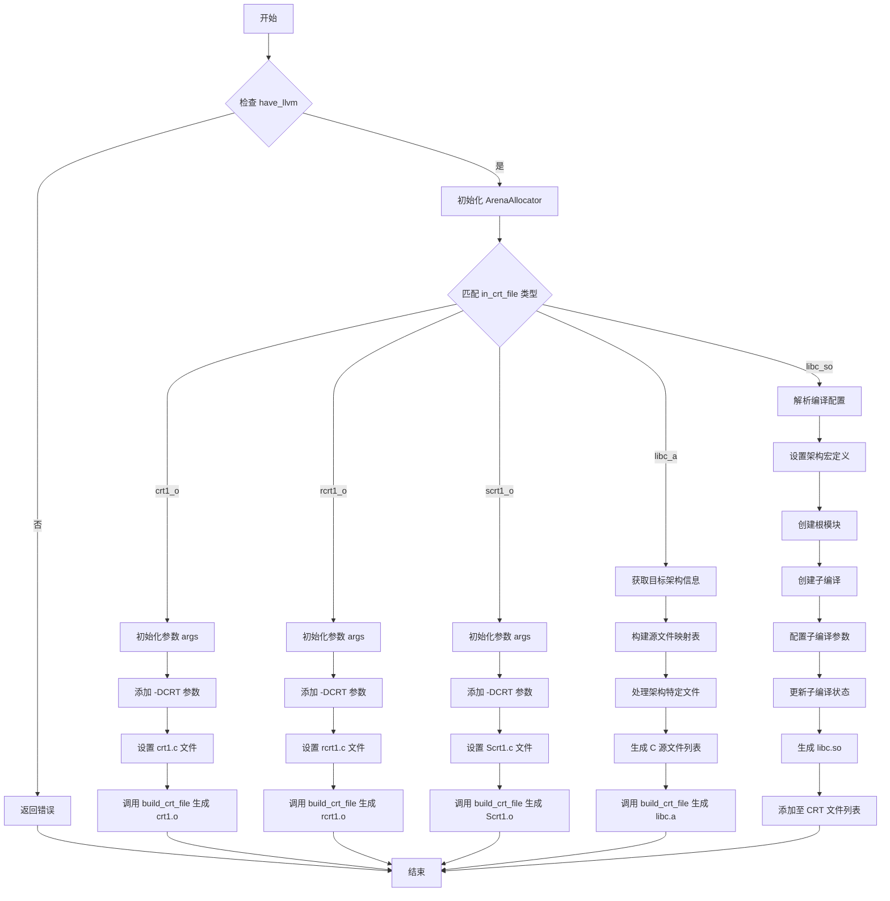

好的，我需要为给定的Zig函数`buildCrtFile`绘制一个流程图。首先，我要理解这个函数的结构和逻辑。

函数开始时，检查`build_options.have_llvm`，如果不存在，返回错误。接下来初始化一个Arena分配器，并根据`in_crt_file`的不同类型执行不同的逻辑。

看起来函数主要处理四种类型的CrtFile：`.crt1_o`、`.rcrt1_o`、`.scrt1_o`、`.libc_a`和`.libc_so`。每种情况都有不同的处理流程，包括设置参数、添加源文件、调用`comp.build_crt_file`或处理动态库的构建。

我需要将每个分支的逻辑分解成流程图的节点。比如，对于`.crt1_o`，会创建参数列表，添加特定文件，然后调用`build_crt_file`。类似地，`.libc_a`和`.libc_so`有更复杂的逻辑，包括处理架构特定的文件、生成配置等。

需要注意的是，每个分支结束后的返回路径可能不同，特别是`.libc_so`部分涉及子编译的创建和资源管理。此外，错误处理和资源释放（如`defer`语句）也需要在流程图中体现。

可能存在重复的步骤，比如初始化`args`和添加`-DCRT`，这些可以抽象为公共节点。同时，`.libc_so`分支中的子编译流程需要详细展开，包括模块创建、配置设置、子编译的创建与销毁等。

最后，确保流程图的逻辑正确，每个条件分支清晰，并且所有可能的路径都被覆盖，包括错误返回的情况。
================================================
