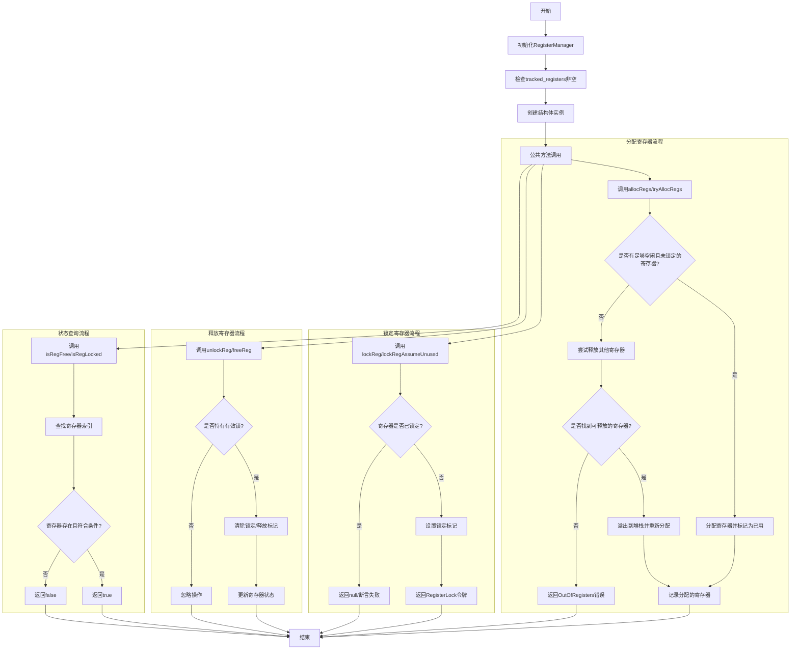

嗯，我需要为这个Zig函数`RegisterManager`画一个流程图。首先，我得理解这个函数的结构和逻辑。看起来这是一个泛型函数，返回一个结构体类型，用来管理寄存器的分配、释放、锁定等操作。结构体内部有很多方法，比如`tryAllocRegs`、`allocRegs`、`lockReg`、`unlockReg`等等。

首先，我应该确定流程图的范围。整个`RegisterManager`函数返回一个结构体，里面有很多方法。如果我要画整个函数的流程图，可能需要涵盖结构体的各个方法以及它们之间的交互。不过，这样可能会很复杂，因为方法很多，而且彼此之间有调用关系。或者，我可以选择主要的公共方法，如`allocRegs`、`tryAllocRegs`、`lockReg`等，画出它们的流程。

接下来，我需要理清每个主要方法的步骤。比如，`tryAllocRegs`方法尝试分配指定数量的寄存器，首先检查是否有足够的空闲且未锁定的寄存器，如果有，就分配并标记为已使用；如果没有，返回null。而`allocRegs`在无法分配时，会尝试释放其他寄存器来满足需求，可能会溢出到堆栈分配。

另外，还有锁定的机制，`lockReg`和`unlockReg`用于防止某些寄存器被分配。这些操作会影响后续的分配流程。

在绘制流程图时，应该从入口方法开始，比如用户调用`allocReg`或`tryAllocReg`，然后根据条件分支（是否有足够寄存器、是否锁定等）进行不同的处理步骤。每个方法内部的条件判断和循环也需要表现出来。

可能需要注意的难点是处理多个寄存器的分配，例如在`allocRegs`中需要处理多个寄存器的分配，可能需要循环遍历可用的寄存器，并处理溢出情况。此外，锁定的寄存器不能被分配，所以在分配时需要排除这些。

另外，需要考虑到错误处理，比如`allocRegs`可能会返回`OutOfRegisters`错误，这时候流程图中需要体现错误路径。

总结一下，流程图的大致步骤可能包括：
1. 初始化RegisterManager，检查tracked_registers是否非空。
2. 分配寄存器（tryAllocRegs/allocRegs）：
   a. 检查空闲且未锁定的寄存器。
   b. 如果有足够，分配并标记。
   c. 如果不够，尝试释放其他寄存器（可能需要溢出到堆栈）。
3. 锁定和解锁寄存器（lockReg/unlockReg）。
4. 释放寄存器（freeReg）。
5. 处理错误情况。

可能需要分多个流程图，或者在一个大流程图中分块处理各个方法。不过，由于用户请求的是整个函数的流程图，可能需要整合各个主要方法的流程，但这样可能会很复杂。另一种方式是选择几个核心方法，分别绘制它们的流程图，然后展示它们之间的关系。

或者，可以按照模块化的方式，先画出结构体的各个组成部分（如寄存器状态、锁定状态等），然后展示各个方法如何修改这些状态。

可能需要使用Mermaid的不同图形元素，如开始/结束节点、操作步骤、条件判断、循环、子流程等。例如，`tryAllocRegs`中的循环遍历可用寄存器，直到找到足够数量或返回null。

需要确保每个步骤之间的逻辑正确，条件分支清晰。可能需要多次审阅代码，确保理解每个方法的逻辑，避免遗漏关键步骤。
================================================

该流程图特点：
1. 使用主流程+子流程结构展示核心功能模块
2. 包含四个主要操作场景：寄存器分配、锁定、释放和状态查询
3. 通过菱形节点表示条件判断分支
4. 用不同颜色区域划分功能模块
5. 展示了错误处理路径（如OutOfRegisters错误）
6. 体现寄存器管理的关键状态转换逻辑
7. 包含与堆栈溢出的交互操作节点
8. 显示锁定令牌的生命周期管理