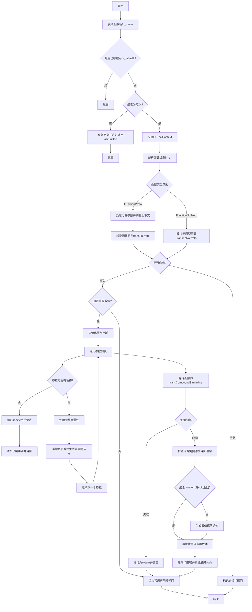

好的，我需要为提供的Zig函数`visitFnDecl`绘制一个流程图。首先，我需要理解这个函数的主要逻辑和各个部分的作用。

首先，函数`visitFnDecl`处理一个函数声明（`fn_decl`），主要步骤包括：
1. 获取函数名并检查是否已处理过，避免重复处理。
2. 跳过非定义的声明，如果有定义则递归处理。
3. 构建函数声明的上下文信息（`FnDeclContext`）。
4. 解析函数类型，处理可能的属性类型和括号类型。
5. 根据函数类型（原型或无原型）进行不同的处理。
6. 处理参数，包括参数名、常量性检查和变量重命名。
7. 翻译函数体，处理可能的错误情况，并添加返回语句（如果需要）。
8. 最后添加顶层声明。

接下来，我需要将这些步骤转化为流程图中的各个节点和判断分支。需要注意条件判断和循环结构，例如检查是否已处理、是否有函数体、是否为可变参数函数等。

可能的流程节点包括：
- 开始
- 获取函数名
- 检查是否已存在（是则返回）
- 检查是否为定义（否则处理定义）
- 构建上下文信息
- 解析函数类型
- 处理函数原型或无原型
- 处理参数
- 处理函数体
- 添加返回语句
- 添加顶层声明
- 错误处理

需要处理的条件分支包括：
- `if (c.global_scope.sym_table.contains(fn_name))`
- `if (!fn_decl.isThisDeclarationADefinition())`
- `if (has_body and fn_proto_type.isVariadic())`
- `if (!decl_ctx.has_body)`
- 参数名是否存在
- 是否常量参数
- 函数体翻译是否出错
- 是否需要添加返回语句

在绘制流程图时，应使用不同的形状表示开始/结束、处理步骤、条件判断、循环和子流程。例如，矩形框表示处理步骤，菱形表示条件判断，椭圆形表示开始和结束。

需要确保所有可能的路径都被覆盖，特别是错误处理路径，如`failDecl`和`warn`的情况。同时，循环处理函数类型（`while (true)`）需要正确表示。

最后，整理这些步骤和判断，使用Mermaid语法绘制出清晰的流程图。
================================================
