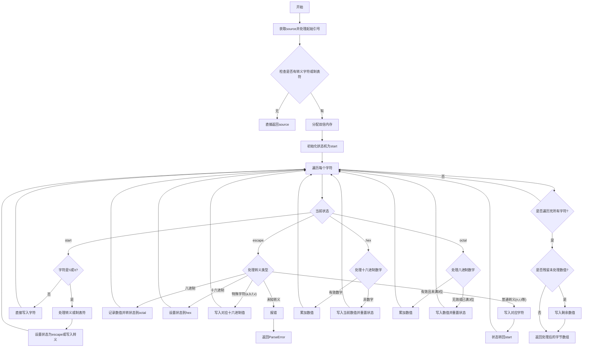

好，我需要为这个Zig函数画一个流程图。首先，我需要理解这个函数的功能。函数名是zigifyEscapeSequences，看起来是处理转义序列的转换，将C风格的转义序列转换成Zig风格的。例如，处理\n、\t、八进制和十六进制转义等。

首先，我会通读代码，了解整体结构。函数开始处理输入的字符串，找到引号之后的部分，然后检查是否有转义字符或制表符。如果没有，直接返回原内容。如果有，就分配内存进行处理。

接下来是状态机，有四个状态：start、escape、hex、octal。每个状态根据当前字符进行不同的处理。比如在escape状态下，处理不同的转义字符，如\n转换为对应的字符，处理十六进制或八进制转义，遇到不支持的转义会报错。

我需要考虑各个状态之间的转换条件，以及处理过程中的步骤。比如，当遇到反斜杠时进入escape状态，处理完转义字符后回到start状态。处理十六进制或八进制时，需要收集足够的数字，然后转换并写入缓冲区。

可能需要注意循环遍历每个字符，并根据当前状态和字符类型执行不同的操作。同时，处理错误情况，比如无效的转义序列或数值溢出。

接下来，我需要将这些逻辑步骤转化为流程图。使用Mermaid的流程图语法，用不同的节点表示状态和操作，用箭头表示流程的转移。可能需要分块处理不同的状态分支，并处理错误路径。

需要注意处理循环结构，比如for循环遍历每个字符，并在每个字符上根据状态进行处理。同时，结束时的处理，比如最后可能还有未处理的数值需要写入缓冲区。

最后，确保流程图的逻辑与代码一致，覆盖所有分支和错误情况，保持结构清晰，便于理解。
================================================
