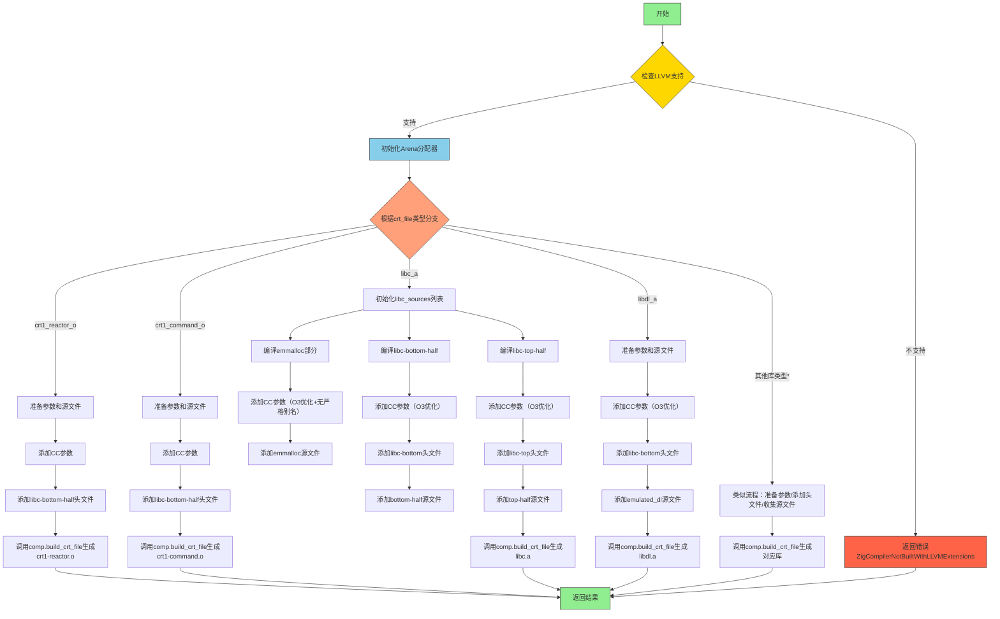

嗯，用户让我用Mermaid画出一个Zig函数的流程图。首先，我需要仔细阅读并理解提供的代码。这个函数叫做buildCrtFile，属于wasi_libc.zig文件。看起来它的作用是根据不同的CrtFile类型构建不同的C运行时文件。

首先，函数开始检查是否启用了LLVM扩展，如果没有，就返回错误。然后初始化了一个Arena分配器，用于内存管理。接着，函数根据crt_file的不同类型进行不同的处理，比如.crt1_reactor_o、.crt1_command_o、.libc_a等等。每个case里面会准备不同的编译参数和源文件，然后调用comp.build_crt_file来构建对应的文件。

我需要把这些逻辑步骤转化为流程图。流程图应该从函数入口开始，检查LLVM，初始化Arena，然后根据不同的crt_file类型分支处理，每个分支里可能有不同的步骤，比如添加编译参数、收集源文件，最后调用build_crt_file。对于.libc_a的情况，里面还分成了编译emmalloc、libc-bottom-half、libc-top-half三个部分，每个部分都有自己的参数和文件处理。

需要注意的是，流程图中要涵盖所有可能的case，包括各种不同的CrtFile类型，以及每个类型内部的具体步骤。可能还需要处理错误情况，但代码中用的是try，所以可能每个步骤都有可能出错并提前返回，但用户可能只关心主要流程，暂时忽略错误处理。

另外，函数在最后调用了comp.build_crt_file，并返回其结果，所以每个分支都应该指向这个调用。对于.libc_a、.libdl_a等不同的库，它们的处理步骤可能类似，只是参数和源文件不同，所以在流程图中可以表示为不同的分支，但结构类似。

可能还需要考虑循环结构，比如在编译多个源文件时使用了for循环，这在流程图中可能需要用循环节点表示。但为了简化，可能直接列出步骤而不是详细画出循环。

总之，流程图的大致结构是：

1. 开始
2. 检查LLVM，失败则返回错误
3. 初始化Arena
4. 根据crt_file类型分支
5. 每个分支处理参数和文件
6. 调用build_crt_file
7. 结束

现在需要将这些步骤用Mermaid语法表达出来，确保每个分支正确，步骤清晰。
================================================

注：  
1. "其他库类型*" 包含：libwasi_emulated_process_clocks_a/libwasi_emulated_getpid_a/libwasi_emulated_mman_a/libwasi_emulated_signal_a，它们的流程模式与libdl_a类似  
2. 具体编译参数差异（如-D_WASI_EMULATED_SIGNAL）在流程中未展开，保持主干逻辑清晰  
3. 内存管理部分（arena_allocator的deinit）在流程中简化为单步初始化操作