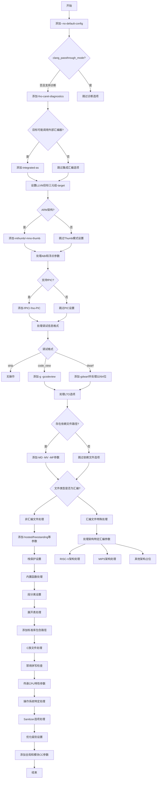

嗯，我需要为这个名为`addCCArgs`的Zig函数画一个流程图。首先，我应该仔细阅读代码，理解它的主要逻辑和各个分支。这个函数的作用是向Clang编译器添加各种参数，根据不同的条件，比如目标平台、文件扩展名、编译模式等。

首先，函数开头有一些初始设置，比如添加`--no-default-config`参数。然后根据是否处于Clang直通模式以及文件扩展名是否支持诊断信息，决定是否添加`-fno-caret-diagnostics`。接下来是关于目标平台的处理，比如是否使用集成汇编器（`-integrated-as`），设置目标三元组（`-target`）等。

然后，根据目标架构的不同，比如ARM，添加对应的参数（`-mthumb`或`-mno-thumb`）。还有一些关于ABI和浮点处理的参数，比如`-mabi`和`-mfloat-abi`。还有关于PIC（位置无关代码）的设置。

之后是关于调试信息的处理，根据不同的调试格式（strip、code_view、dwarf）添加相应的参数。然后是LTO（链接时优化）的设置。

接下来处理依赖文件路径（`-MD`、`-MV`、`-MF`），以及根据文件扩展名是否为汇编文件，添加不同的参数。例如，对于非汇编文件，添加`-ffreestanding`或`-fhosted`，栈保护选项，函数和数据段的分隔等。

对于C族文件（如.c、.cpp），还有一些特定的参数，比如禁用拼写检查（`-fno-spell-checking`），目标CPU特性的传递，操作系统特定的参数（如macOS版本设置），Sanitizer相关的参数，以及优化级别的设置（如-O0、-O2、-Os）。

最后，添加全局和模块特定的CC参数。

我需要将这些步骤按照执行顺序组织起来，并用条件判断来表示不同的分支。比如，是否处于Clang直通模式、目标架构是否为ARM、文件扩展名是否为汇编文件等。每个条件判断下会有不同的参数添加操作。

可能需要注意一些细节，比如处理RISC-V架构时的march参数生成，或者针对不同操作系统（如Windows、macOS、iOS）的特殊处理。此外，优化模式的不同（Debug、ReleaseSafe、ReleaseFast、ReleaseSmall）也会影响参数的选择。

流程图的结构大致可以分为以下几个部分：
1. 初始参数设置
2. 目标平台相关参数
3. 调试和优化参数
4. 文件类型相关参数（汇编、C族文件等）
5. 全局和模块参数添加

每个部分内部有多个条件分支，需要正确连接这些分支，确保逻辑流程正确。
================================================
