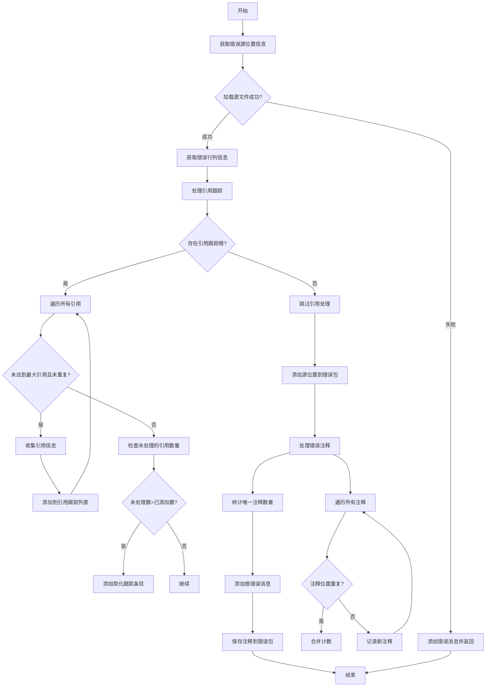

嗯，我需要为这个Zig函数`addModuleErrorMsg`画一个流程图。首先，我得仔细阅读代码，理解它的结构和工作流程。这个函数似乎负责处理模块错误消息，收集相关信息并添加到错误包中。

首先，函数开始时会获取一些基本的信息，比如错误位置、源文件路径，然后尝试加载错误源。如果加载失败，它会添加一个根错误消息并返回。这部分应该对应流程图的第一个判断节点，检查是否能成功加载源文件。

接下来，如果源文件加载成功，函数会处理错误的位置信息，比如获取行号和列号。然后处理引用跟踪（reference trace），这部分看起来比较复杂。需要遍历所有相关的引用，收集每个引用的信息，并添加到`ref_traces`列表中。这里可能需要一个循环结构，判断是否有更多的引用需要处理，直到达到最大引用数量或没有更多引用为止。

在处理引用跟踪的过程中，可能会有一些条件判断，比如是否已经处理过某个引用，或者是否超过了最大引用数量。这些条件分支需要在流程图中体现出来。此外，如果引用的数量超过已处理的条目，可能会添加一个简化的跟踪条目。

之后，函数会处理错误的位置信息，并添加到错误包中。然后处理错误注释（notes），需要去重并统计数量。这里又有一个循环，遍历所有注释，检查是否有重复，并记录数量。这部分可能涉及到另一个循环结构，以及条件判断是否省略源行。

最后，函数将根错误消息和注释添加到错误包中，完成整个流程。

在绘制流程图时，需要注意各个步骤之间的顺序，条件分支（如错误处理、循环终止条件），以及循环结构。可能需要使用不同的形状来表示开始/结束、处理步骤、判断节点等。同时，各个部分的依赖关系和数据流动也需要清晰地表示出来。

可能遇到的挑战是代码中的多个嵌套条件和循环，需要准确地在流程图中表达出来，同时保持图表的简洁性。此外，一些细节，比如内存管理（如`defer`语句）可能不需要在流程图中体现，但关键的逻辑步骤必须包含。

总结一下，流程图的大致步骤可能是：
1. 开始
2. 获取错误源位置信息
3. 尝试加载源文件
4. 失败时添加错误消息并返回
5. 成功则继续处理
6. 获取错误位置的行列信息
7. 处理引用跟踪
   a. 遍历引用
   b. 收集引用信息
   c. 判断是否达到最大数量或重复
8. 处理错误注释
   a. 遍历注释
   b. 去重并统计
9. 添加根错误消息和注释到错误包
10. 结束

需要确保每个判断节点都有两个分支（是/否），循环结构正确表示，并且各个步骤之间的顺序正确。
================================================

该流程图描述了`addModuleErrorMsg`函数的主要逻辑路径：
1. 初始化后尝试加载源文件，失败则直接添加错误消息
2. 成功加载后解析错误位置信息
3. 处理引用跟踪的递归收集过程（包含循环和数量限制）
4. 处理错误注释的去重和统计
5. 最终将所有信息整合到错误包中

关键节点包含：
- 条件判断（菱形）
- 循环处理（引用跟踪和注释处理）
- 错误消息组装
- 资源释放操作（代码中的defer未在图中显示，属于实现细节）

箭头方向表示程序执行流向，矩形框表示具体操作步骤。