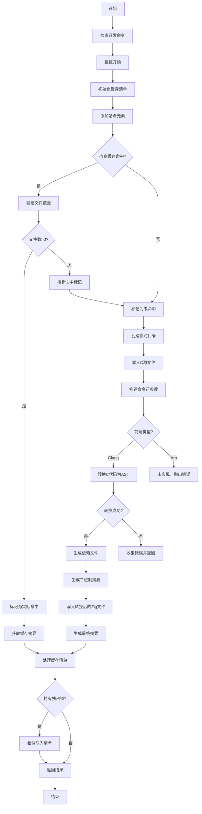

好的，我需要为给定的 Zig 函数 `cImport` 绘制流程图。首先，我需要理解这个函数的主要步骤和逻辑结构。

函数开始部分：
- 检查开发阶段的命令。
- 使用 `tracy_trace` 进行跟踪，结束时释放。
- 定义 `cimport_zig_basename` 为 "cimport.zig"。
- 获取并初始化 `man`（缓存清单），之后释放。

缓存处理：
- 向哈希添加随机数、C 源代码和 C 前端配置。
- 检查是否存在之前的缓存命中，如果命中但文件数为零，则视为未命中。
- 根据 `actual_hit` 的值决定是否生成新的摘要。

未命中时的处理：
- 创建临时目录和文件路径。
- 将 C 源代码写入临时文件。
- 构建命令行参数，添加 C 前端相关的参数。
- 根据 C 前端（Clang 或 Aro）进行不同的处理，这里主要处理 Clang 的情况。
- 处理可能的错误，并将结果转换为树结构。
- 添加依赖文件到清单。
- 生成最终的二进制摘要，并将转换后的 Zig 代码写入文件。

命中时的处理：
- 直接使用清单中的二进制摘要。

最后：
- 如果持有独占锁，尝试写入更新后的清单。
- 返回结果，包括摘要、缓存命中状态和错误信息。

在绘制流程图时，需要将这些步骤分为不同的节点，并用箭头表示流程走向。需要注意条件判断（如 `actual_hit` 的值）导致的分支，以及可能的错误处理路径。

可能存在的疑问点：
1. `man.hit()` 的具体作用是什么？是否会影响流程分支？
2. 如何处理不同的 C 前端（Clang 和 Aro）？目前 Aro 分支未实现。
3. 错误处理部分如何体现在流程图中？例如 `error.SemanticAnalyzeFail` 的处理。

需要确保每个步骤在流程图中正确表示，特别是条件判断和循环部分。同时，注意函数中的资源管理，如 `defer` 语句，虽然不影响流程顺序，但可能在流程图中需要体现资源的释放点。
================================================
