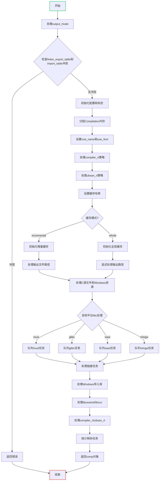

嗯，我需要帮用户画一个Zig函数`create`的流程图。首先，我得仔细看看这个函数的结构和逻辑。这个函数看起来是用来创建编译对象的，里面有很多条件判断和初始化步骤。

首先，函数开始时处理`output_mode`，确定是否是动态库或可执行文件。接着检查是否有冲突的链接器选项，比如`linker_export_table`和`linker_import_table`，如果有冲突就返回错误。

然后，初始化一些配置，比如`have_zcu`，这可能表示是否有Zig编译单元。接下来分配内存给`comp`结构体，并设置各种属性，比如`root_name`、`use_llvm`等。这里还处理了编译器运行时（compiler_rt）和ubsan运行时的策略，根据不同的条件选择不同的策略。

之后，设置缓存哈希，添加各种配置参数到哈希中，确保缓存的一致性。然后根据缓存模式（`incremental`或`whole`）初始化不同的缓存结构，并处理输出文件的路径。

接下来，处理C源文件和Windows资源文件，将它们添加到工作队列中。根据目标平台的不同，处理libc的依赖，比如musl、glibc、wasi等，并设置相应的任务队列。

最后，处理链接任务，包括加载对象文件、处理Windows导入库、构建libunwind、libcxx等，并计算剩余的前链接任务数量。

整个流程涉及很多条件分支和初始化步骤，需要将这些步骤分解成流程图中的各个节点，并用箭头表示逻辑流向。需要注意的是，条件判断（如switch语句和if条件）会导致不同的分支路径，每个分支需要单独处理。

可能需要注意的节点包括：
1. 检查输出模式并设置相关标志。
2. 处理链接器选项冲突。
3. 初始化comp结构体和相关配置。
4. 设置缓存哈希和缓存模式。
5. 处理C和RC源文件。
6. 根据目标平台处理libc依赖。
7. 处理链接任务和构建运行时库。

需要将这些步骤按顺序排列，并根据条件分支画出不同的路径。同时，错误处理和资源释放的步骤（如errdefer）也需要在流程图中体现，可能作为异常退出路径。
================================================

该流程图的关键路径说明：
1. 从输出模式判断开始建立基础配置
2. 通过多层条件判断处理不同运行时库的构建策略
3. 根据缓存模式分支出不同的路径处理
4. 针对不同目标平台进行libc适配
5. 最终整合所有预链接任务并返回编译对象
6. 错误路径直接终止流程

深色节点表示流程起始/终止，箭头表示主要控制流，菱形表示条件判断。实际实现中还包含大量并行任务队列（如C对象编译、资源处理等），此处简化为线性流程。