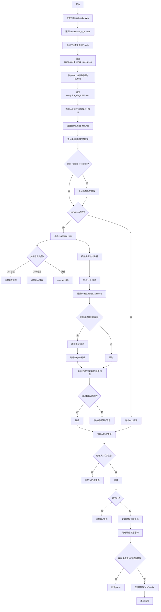

好，我需要根据提供的Zig函数`getAllErrorsAlloc`来画一个流程图。首先，我要理解这个函数的主要逻辑步骤，然后将其转化为流程图的结构。

首先，函数开始于初始化一个错误包（ErrorBundle.Wip），然后使用defer确保在函数结束时释放资源。接下来，函数处理多个错误源：

1. **处理失败的C对象**：遍历`comp.failed_c_objects`，将每个诊断包添加到错误包中。
2. **处理失败的Win32资源**：遍历`comp.failed_win32_resources`，将错误包作为根错误添加。
3. **处理链接器错误（LLD）**：遍历`comp.link_diags.lld.items`，添加错误消息及其上下文行作为注释。
4. **处理其他杂项失败**：遍历`comp.misc_failures`，添加错误消息及其子错误包作为注释。
5. **检查内存分配失败**：如果`alloc_failure_occurred`为真，添加相应的根错误消息。
6. **处理ZCU相关错误**：如果存在`comp.zcu`，处理各种模块错误，包括文件错误、ZIR/Zoir错误、分析错误、代码生成错误、类型错误和导出错误。
7. **错误限制检查**：如果实际错误数超过限制，添加相关错误消息。
8. **处理其他链接诊断**：如缺少入口点、缺少libc等情况。
9. **处理编译日志语句**：如果没有其他错误但存在编译日志，添加相应错误。
10. **增量编译检查**：在增量编译模式下，验证是否有未报告的传递性错误。
11. **最终处理**：将错误包转换为自有包，并返回。

接下来，我需要将这些步骤组织成流程图的节点，并确定它们之间的逻辑顺序和条件分支。例如，处理ZCU错误的部分有多个子步骤，可能需要多个节点和条件判断（如是否存在ZCU，是否跳过分析等）。

需要注意条件判断部分，例如`if (comp.zcu)`、`if (comp.incremental)`等，这些需要作为决策节点。同时，循环结构（如for循环）可以用流程图的循环结构表示。

可能还需要处理错误路径，例如在排序过程中可能发生的错误，需要使用错误处理节点。

最后，确保流程图的开始和结束节点正确，以及所有步骤都被正确连接。
================================================
