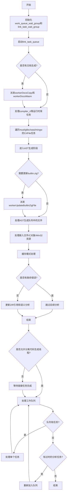

好的，我现在需要帮用户用Mermaid画出他们提供的Zig函数`performAllAllTheWorkInner`的流程图。首先，我需要仔细阅读并理解这个函数的逻辑。

这个函数看起来是处理编译过程中的多个任务，包括生成AST、编译C对象、处理链接任务等。函数内部有多个条件判断和循环，还有线程池的任务派发。我需要理清每个步骤的顺序和分支情况。

首先，函数开始处初始化了一些等待组（WaitGroup），然后检查是否有链接任务队列启动，如果有的话，会在线程池中派发`link.flushTaskQueue`任务。接着处理文档生成相关的任务，比如`workerDocsCopy`和`workerDocsWasm`。

之后，有一系列的条件检查，针对不同的库和运行时（如compiler_rt、libfuzzer、ubsan_rt等），如果对应的任务队列中存在作业，就通过`spawnManager`派发相应的构建任务，例如`buildRt`、`buildGlibcSharedObjects`等。

接下来是处理不同C运行时文件（如musl、glibc、wasi_libc、mingw）的构建任务，通过遍历枚举类型并检查对应的任务队列，派发相应的构建函数。

然后进入AST生成阶段，处理内置的`builtin.zig`文件，确保没有竞争条件，并通过线程池派发`workerUpdateBuiltinZigFile`任务。之后处理AST生成队列中的文件索引，派发`workerUpdateFile`任务，以及嵌入文件和C对象、Win32资源的处理。

在处理完这些任务后，函数检查缓存模式，如果是全缓存模式，则将每个源文件添加到缓存清单中。接着报告多模块错误，检查是否有致命错误导致编译失败，如果有则跳过后续分析。

如果一切正常，进入语义分析和代码生成阶段，设置相应的进度节点。然后检查是否需要等待所有链接任务完成，如果是，则等待并处理可能的错误。

最后，进入一个循环处理工作队列中的任务，直到所有任务完成。如果有过时的分析任务需要处理，则重新加入队列，直到所有工作完成。

在画流程图时，需要将这些步骤转化为流程节点，注意条件判断、循环结构以及并行任务的表示。可能需要使用子流程来分组不同的任务派发部分，比如链接任务、文档任务、运行时构建、AST生成等。每个条件判断对应一个菱形分支，循环结构用循环节点表示。并行任务可以用并行框（如par）或者通过不同分支表示。

需要注意的是，Mermaid的流程图语法可能不支持所有复杂的并行结构，但可以通过适当的分支和子图来近似表示。同时，保持流程图的清晰和可读性，避免过于复杂。

最后，根据上述分析，组织成Mermaid的流程图代码，确保每个主要步骤和分支都被正确表示。
================================================

该流程图展示了函数的主要执行逻辑：
1. 初始化等待组和启动链接任务
2. 处理文档生成和运行时库构建
3. 遍历不同C运行时文件构建任务
4. AST生成阶段（包括builtin.zig特殊处理）
5. 缓存管理和错误检查
6. 语义分析和代码生成准备
7. 工作队列处理循环
8. 最终清理和结束

并行任务（如线程池派发）通过分支路径表示，关键决策点使用菱形符号，循环结构通过箭头回指实现。实际执行中多个路径可能并行执行，但流程图通过顺序结构简化表示。