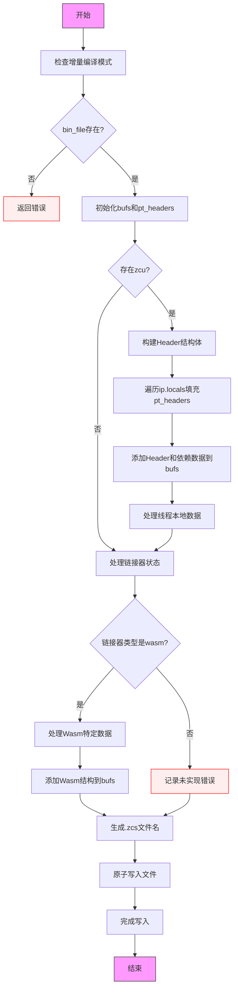

好的，我需要为这个Zig函数`saveState`绘制流程图。首先，我得仔细理解这个函数的逻辑结构。函数的主要目的是保存编译状态，可能用于增量编译。让我逐步分析。

首先，函数开始于检查是否是增量编译模式，通过`dev.check(.incremental);`。接下来，获取`comp.bin_file`，如果不存在则返回。然后初始化了一些缓冲区数组`bufs`和`pt_headers`，用于存储数据块和每个线程的头部信息。

接下来，如果存在`comp.zcu`，则处理`intern_pool`的数据。这里构建了一个`Header`结构体，记录各种依赖的长度。然后遍历`ip.locals`，为每个本地线程生成对应的头部信息，并添加到`pt_headers`中。随后，将头部信息和各个依赖项的数据通过`addBuf`函数添加到`bufs`中。

之后处理链接器状态，根据`lf.tag`的不同类型（如`.wasm`）执行不同的处理逻辑。这里有很多针对Wasm文件的具体操作，比如处理字符串、函数类型、导入导出等，并将这些数据块加入`bufs`。其他链接器类型暂时未实现，记录错误日志。

最后，生成一个文件名，使用原子文件操作将`bufs`中的数据写入文件，确保在写入过程中发生错误不会损坏原有状态文件。

现在需要将这些步骤转化为流程图。需要注意条件分支，比如`if (comp.zcu)`和`switch (lf.tag)`，以及循环结构，如遍历`ip.locals`和`wasm`的各种数据结构。同时，错误处理和资源释放（如`defer`语句）也需要在流程图中体现。

可能的结构如下：
1. 开始
2. 检查增量编译
3. 获取bin_file，不存在则返回错误
4. 初始化bufs和pt_headers
5. 处理zcu和intern_pool的数据
   a. 构建Header
   b. 遍历locals填充pt_headers
   c. 添加各个依赖项到bufs
6. 处理链接器状态（以Wasm为例）
   a. 处理各种Wasm结构体数据并添加到bufs
7. 生成文件名
8. 原子写入文件
9. 结束

需要注意各个步骤之间的条件判断和循环，使用不同的流程节点表示。例如，处理`ip.locals`时有一个循环，每个local生成对应的pt_header。另外，Wasm处理部分有很多不同的数据结构的处理，可能需要分解成多个子步骤。

可能忽略一些细节，比如具体的错误处理路径，但整体结构应覆盖主要流程。需要确保每个条件分支（如if和switch）都有对应的判断节点，以及相应的处理流程。
================================================

流程图说明：
1. **条件分支**用菱形节点表示（如`bin_file存在?`）
2. **关键操作**用矩形节点表示（如`处理Wasm特定数据`）
3. **错误路径**用红色标注（如返回错误和未实现错误）
4. **核心数据流**通过箭头连接，展示从初始化到文件写入的完整流程
5. **特殊处理**：
   - WASM链接器类型有详细的数据序列化过程
   - 原子文件写入保证状态完整性
   - 增量编译检查作为前置条件
6. **异步操作**（如`defer`资源释放）未显式展示，隐含在流程中