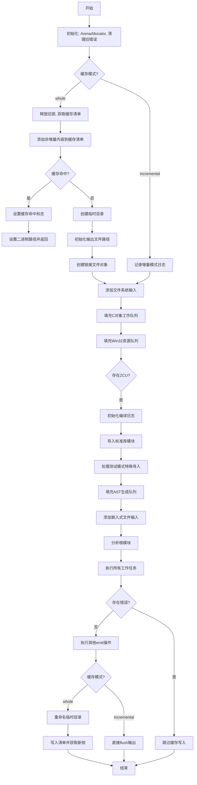

好的，我现在需要帮助用户用Mermaid画出他们提供的Zig函数`update`的流程图。首先，我需要仔细阅读并理解这个函数的逻辑结构，然后将其转化为流程图的形式。

首先，我会通读整个函数，了解其主要步骤和分支。函数`update`似乎处理了编译过程中的缓存策略，分为`whole`和`incremental`两种模式。整个函数的结构可能包含多个条件分支和循环，例如处理C对象、Win32资源、模块分析等。

接下来，我需要确定函数的主要流程。函数开始处初始化了一些变量和清理操作，然后根据`comp.cache_use`的值进入不同的分支。`whole`模式下会进行缓存检查、处理临时目录、创建文件对象等；而`incremental`模式则可能有不同的处理步骤。

在分析过程中，需要注意函数中的错误处理（如`try`和`catch`）、资源管理（如`defer`语句），以及各种工作队列的处理（如`c_object_work_queue`、`win32_resource_work_queue`、`astgen_work_queue`）。这些部分在流程图中需要以不同的节点或分支表示。

另外，函数中有大量的条件判断和循环，例如`switch`语句处理不同的缓存模式，`for`循环处理C对象和Win32资源，以及可能的错误处理路径。这些都需要在流程图中明确标出，以确保逻辑的清晰。

绘制流程图时，应该从函数入口开始，按顺序处理各个步骤，使用条件判断节点来区分不同的缓存模式。每个主要操作（如初始化、缓存检查、队列处理、模块分析、错误处理等）都应当作为一个独立的节点。同时，错误处理路径和资源释放操作（如`defer`）也需要体现在流程图中，可能作为并行或分支路径。

需要注意的是，函数末尾的`flush`操作和缓存写入也是关键步骤，特别是在不同缓存模式下有不同的处理方式。此外，函数结束时根据是否有错误决定是否跳过某些步骤，这也是流程图需要展示的重要分支。

最后，确保流程图的逻辑连贯，各步骤之间的转换清晰，使用合适的箭头和条件标签。可能还需要合并一些重复的步骤，例如队列处理部分，避免流程图过于复杂。

在绘制过程中，可能会遇到需要简化某些复杂逻辑的情况，比如将多个类似的循环合并为一个节点，或者将错误处理集中表示。这有助于保持流程图的可读性，同时不遗漏关键步骤。

总结来说，我需要将函数分解为以下几个主要部分：
1. 初始化及清理
2. 缓存模式判断（whole vs incremental）
3. Whole缓存模式的处理：缓存检查、临时目录创建、文件处理
4. 添加文件系统输入
5. 处理C对象和Win32资源
6. 模块分析和工作队列处理
7. 执行所有工作并处理结果
8. 错误检查和后续处理
9. 缓存写入和资源释放

每个部分需要细化为具体的步骤，并根据条件分支连接起来。确保所有错误路径和资源管理操作都被正确表示。
================================================

流程图说明：
1. 入口点初始化内存分配器和清理环境
2. 根据缓存模式分为whole/incremental两条主路径
3. whole模式处理缓存检查、临时目录管理和二进制文件创建
4. 公共路径包含文件系统输入收集、多类型工作队列填充
5. ZCU模块处理包含标准库导入、测试模式处理和AST生成
6. 执行完所有工作后处理错误状态和输出操作
7. 最后根据缓存模式完成不同的缓存写入流程
8. 错误路径会跳过缓存写入直接结束流程

该流程图保留了关键决策点和主要处理阶段，合并了部分重复操作步骤以保持可读性，同时突出缓存模式差异和错误处理逻辑。