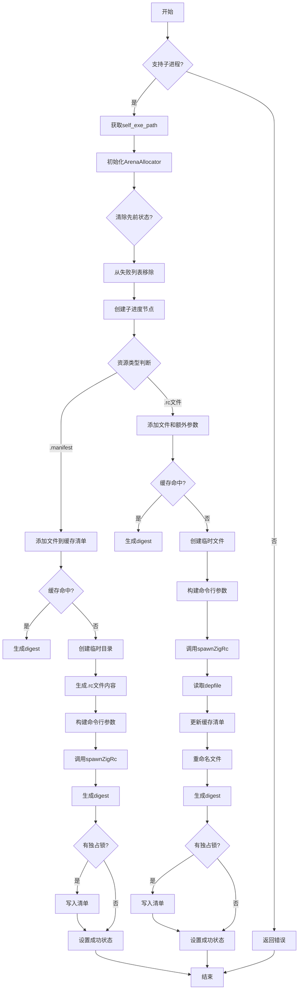

嗯，用户让我用Mermaid画出这个Zig函数的流程图。首先，我需要理解这个函数的功能。函数名是updateWin32Resource，看起来是处理Windows资源编译的。函数里有很多条件判断和不同的处理路径，比如处理.manifest文件和.rc文件的情况。

首先，我应该从函数入口开始，逐步分解每个步骤。函数首先检查是否支持子进程生成，如果不支持就返回错误。然后获取自身可执行路径，处理进度跟踪，记录日志。接着使用ArenaAllocator进行内存管理，处理之前的失败状态，创建子进程节点。

接下来，函数分为两部分处理：如果是.manifest文件，就生成对应的.rc和.res文件，调用spawnZigRc执行编译；如果是.rc文件，则处理依赖关系，生成.res文件，并处理depfile，更新缓存清单。两种情况最后都会更新win32_resource的状态。

需要注意条件分支，比如处理.manifest和.rc的不同逻辑，以及缓存命中和未命中的情况。在画流程图时，需要明确每个判断节点，比如检查src类型、缓存是否命中、是否获得独占锁等。同时，错误处理和资源释放也需要体现在流程中，比如defer语句。

可能遇到的难点是如何将复杂的逻辑分支清晰地用流程图表示，避免过于复杂。需要合理分组步骤，使用子流程或者注释来简化。另外，函数中有多个错误返回点，需要在流程图中体现错误路径。

最后，确保流程图的逻辑顺序正确，步骤之间的转换明确，使用合适的Mermaid语法，如条件判断的菱形框，处理步骤的矩形框，以及开始结束的圆角矩形。
================================================

该流程图的关键节点说明：
1. 入口先检查操作系统是否支持生成子进程
2. 根据资源类型（.manifest/.rc）分两个主要处理路径
3. .manifest路径直接生成资源描述文件并编译
4. .rc路径需要处理依赖文件并更新缓存清单
5. 两个路径最终都会处理缓存锁状态和设置编译结果
6. 使用菱形节点表示条件判断，矩形节点表示操作步骤
7. 所有路径最终收敛到结束节点