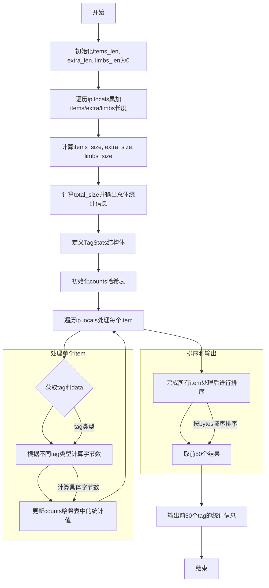

嗯，用户让我用Mermaid画出一个Zig函数的流程图。首先，我需要仔细阅读这个函数，理解它的结构和逻辑。这个函数叫做dumpStatsFallible，看起来是用来统计InternPool的各种信息，比如内存使用情况，然后打印出来。

首先，函数开始的时候初始化了三个变量items_len、extra_len、limbs_len，然后遍历ip.locals，累加每个local的items、extra、limbs的长度。接下来计算各个部分的大小，比如items_size是(1+4)*items_len，这可能对应某个结构体的每个元素占5字节？然后总大小是InternPool的结构体大小加上各个部分的总和。

之后用std.debug.print输出统计信息。然后定义了一个TagStats结构体，用来记录每个Tag的出现次数和字节数。接着用了一个AutoArrayHashMap来存储这些统计信息。

接下来的大循环遍历每个local的items，根据不同的tag类型计算对应的字节数。这里有很多switch case，每个tag对应不同的计算方式，比如.type_error_set需要根据额外数据计算大小，.type_struct则涉及更多复杂的结构，需要处理字段、对齐等。

处理完所有tag之后，对统计结果进行排序，取前50名，最后打印出来。

画流程图的话，需要把这些步骤分解成不同的节点。首先是初始化变量，然后是遍历locals累加长度，计算各部分大小，输出总统计信息。接着初始化统计结构，再次遍历locals中的每个item，根据tag计算字节数并更新统计。最后排序统计结果，输出前50的tag信息。

需要注意循环和条件判断的分支，比如每个tag对应的不同计算方式可能会有不同的处理流程。此外，排序部分也是一个关键步骤，需要明确如何排序和截取前50。

可能遇到的难点是如何将复杂的switch case转化为流程图中的判断节点，尤其是那些带有嵌套计算的tag处理。需要确保每个case都被正确表示，同时保持流程图的简洁性。另外，两次遍历locals（一次是累加长度，另一次是统计tag）需要明确区分，避免混淆。

总的来说，流程图应该从函数入口开始，分步骤展示各个处理阶段，包括循环、条件判断、数据统计和结果输出。使用Mermaid的语法，用不同的节点和箭头连接这些步骤，确保逻辑清晰。
================================================
