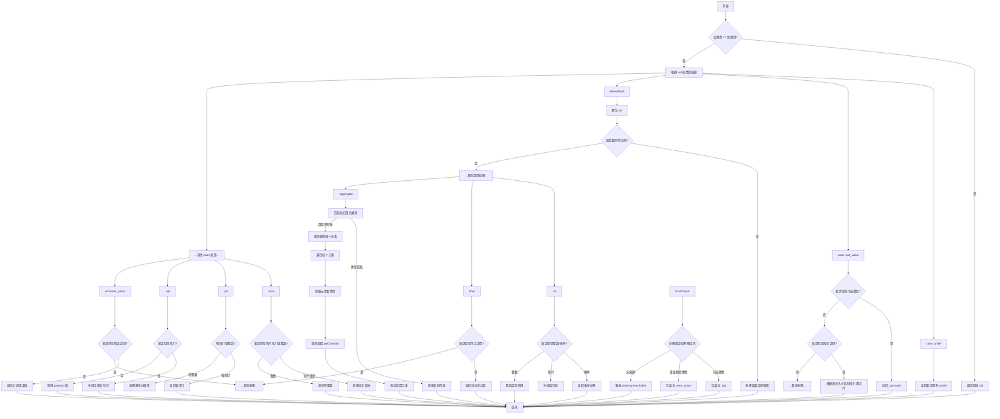

好的，我现在需要为提供的Zig函数`getCoerced`绘制一个流程图。首先，我需要理解这个函数的功能和结构。函数的主要作用似乎是根据不同的类型和值进行强制类型转换，并返回转换后的值。函数内部有很多条件分支，处理各种情况，比如处理`undef`、`null_value`、`int`、`float`、`enum_tag`、`slice`、`ptr`、`opt`、`err`、`error_union`、`aggregate`等不同类型的情况。

首先，我应该确定函数的入口和主要分支。函数一开始检查旧类型和新类型是否相同，如果相同就直接返回原值。如果不相同，进入不同的情况处理。接下来，函数通过`switch (val)`来区分不同的值类型，每个case处理对应的类型转换逻辑。例如，处理`undef`时直接返回新类型的`undef`；处理`null_value`时根据新类型是否是可选类型或指针类型进行不同的处理。

接下来，函数处理其他类型的值，比如`int`、`float`等，每个类型可能有不同的转换规则。例如，将整数转换为枚举类型时，需要获取对应的标签值；将指针转换为整数类型时，处理不同的指针大小等。

在处理聚合类型（`aggregate`）时，需要递归地处理每个元素，确保每个元素都进行类型转换。这里还涉及到内存分配和复制，需要注意错误处理和资源释放。

最后，函数处理一些特殊情况，比如将普通值转换为可选类型或错误联合类型，并在无法处理时触发panic或unreachable。

为了绘制流程图，我需要将这些逻辑步骤转化为流程图的节点和分支。每个主要的条件判断（如`if`、`switch`）对应一个决策节点，每个处理路径对应不同的操作节点。由于函数结构复杂，包含多层嵌套的条件判断，流程图可能会比较庞大，需要合理组织层次，避免过于混乱。

需要注意的几个关键点：
1. 函数开始时的类型检查，直接返回或进入后续处理。
2. 根据`val`的不同类型分派到不同的处理逻辑。
3. 处理每种类型时的具体转换步骤，可能包括递归调用`getCoerced`。
4. 最后的特殊情况处理，如转换为`opt_type`或`error_union_type`。
5. 错误处理和未实现情况的处理（panic或unreachable）。

在绘制过程中，可能需要将复杂的逻辑拆分成子流程，尤其是递归处理和聚合类型的处理部分，以确保流程图的可读性。此外，需要确保所有的条件分支都有对应的路径，避免遗漏。

现在，我需要将上述分析转化为Mermaid的流程图语法，确保每个步骤和分支正确对应代码逻辑。需要注意的是，Mermaid的流程图语法不支持嵌套的子图，但可以通过合理的节点连接来表现层次结构。对于递归调用部分，可能需要用注释或单独的节点来表示递归过程。

总结一下，流程图的步骤大致如下：
1. 开始。
2. 检查旧类型和新类型是否相同，是则返回原值。
3. 否则，根据`val`的类型进入不同的处理分支。
4. 每个分支处理对应的类型转换逻辑，可能涉及递归调用。
5. 处理完成后返回转换后的值。
6. 如果所有分支都无法处理，触发panic或unreachable。

在具体实现时，需要详细列出每个分支的条件和操作，确保逻辑正确无误。同时，注意代码中的错误处理（如`try`和错误返回）也需要在流程图中体现。
================================================

注：由于代码逻辑复杂，此流程图为简化版本，主要突出关键分支。实际实现中：
1. 每个 `switch` 分支可能需要更详细的子流程
2. 递归调用（如 `getCoerced` 和 `getCoercedInts`）需要特殊标记
3. 内存管理操作（alloc/free）未在流程中显式体现
4. 错误处理路径（try/catch）通过连接线隐含表示