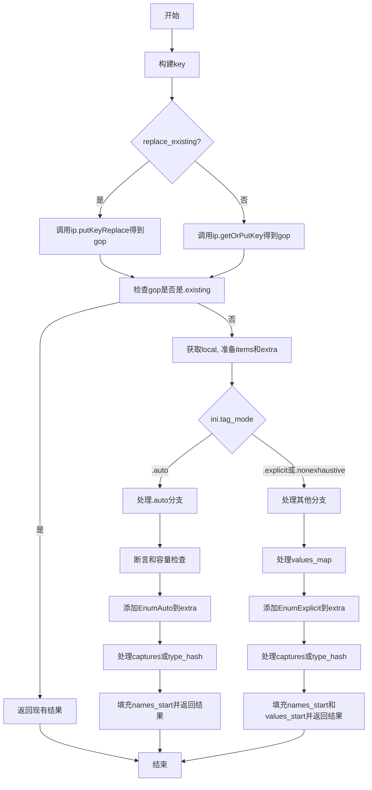

嗯，我现在需要为这个Zig函数`getEnumType`画一个流程图。首先，我需要理解这个函数的结构和逻辑。让我先通读一遍代码，看看它的主要步骤是什么。

函数`getEnumType`的参数包括`ip`（InternPool指针）、`gpa`（分配器）、`tid`（线程ID）、`ini`（枚举类型初始化结构体）和`replace_existing`（布尔值）。返回类型是`Allocator.Error!WipEnumType.Result`，说明可能返回错误，或者一个结果。

首先，函数内部构造了一个`key`变量，根据`ini.key`的不同情况来设置不同的字段。看起来`ini.key`可能有三种情况：`.declared`、`.declared_owned_captures`和`.reified`，每种情况对应的`key`结构不同。

接下来，根据`replace_existing`的值，调用`ip.putKeyReplace`或者`ip.getOrPutKey`，得到`gop`变量。这里可能需要处理哈希表的插入或获取操作。如果`gop`是`.existing`，就直接返回现有的结果。

然后，函数获取本地线程的数据`local`，并准备`items`和`extra`的空间。接着，根据`ini.tag_mode`的不同（`.auto`、`.explicit`、`.nonexhaustive`）进行不同的处理。

对于`.auto`模式，首先进行一些断言和容量检查，然后添加`EnumAuto`结构到`extra`中，处理`captures`的数据，并设置`names_map`。之后，填充`items`和`extra`，返回一个包含各种索引和映射的`WipEnumType.Result`。

对于`.explicit`和`.nonexhaustive`模式，处理方式类似，但会处理`values_map`，并且根据是否有值来决定是否分配额外的空间。最后，同样填充`items`和`extra`，返回相应的结果。

现在，我需要将这些步骤转化为流程图。流程图通常包括开始、结束、判断、处理步骤等。可能的流程如下：

1. 开始函数。
2. 根据`ini.key`构建`key`。
3. 根据`replace_existing`选择`putKeyReplace`或`getOrPutKey`。
4. 检查`gop`是否是`.existing`，如果是，返回现有结果。
5. 获取`local`，准备`items`和`extra`。
6. 根据`ini.tag_mode`分支处理：
   a. `.auto`模式：
      i. 断言和容量检查。
      ii. 添加`EnumAuto`到`extra`。
      iii. 处理`captures`或`type_hash`。
      iv. 填充`names_start`并返回结果。
   b. `.explicit`或`.nonexhaustive`模式：
      i. 处理`values_map`。
      ii. 添加`EnumExplicit`到`extra`。
      iii. 处理`captures`或`type_hash`。
      iv. 填充`names_start`和`values_start`并返回结果。
7. 结束函数。

需要注意错误处理部分，比如`errdefer`的使用，但流程图可能不需要详细到每个错误处理。另外，条件判断和循环结构需要正确表示。

现在，我需要用Mermaid语法将这些步骤结构化。可能需要使用子图来处理不同的`tag_mode`分支。例如：



不过可能需要更详细地拆解每个步骤，确保所有条件分支都被覆盖。例如，在`.explicit`或`.nonexhaustive`分支中，是否有不同的处理？代码中`ini.tag_mode`为`.explicit`时，`items`的tag是`.type_enum_explicit`，而`.nonexhaustive`是`.type_enum_nonexhaustive`，这在流程图中是否需要区分？

可能需要在分支内部进一步拆分。例如：

对于`.explicit`和`.nonexhaustive`，虽然大部分处理相同，但`items.tag`不同，所以流程图可以合并处理，但标注不同的tag设置。或者，是否需要分开处理？

另外，错误处理部分（如`errdefer`）可能需要作为步骤的一部分，但在流程图中可能简化为一个步骤，如“处理错误回滚”或者忽略，除非对流程有影响。

现在，根据这些思考，画出最终的Mermaid流程图。
================================================
```mermaid
flowchart TD
    start([开始]) --> buildKey[构建key]
    buildKey --> checkReplace{replace_existing?}
    checkReplace -->|是| putReplace[调用ip.putKeyReplace得到gop]
    checkReplace -->|否| getOrPut[尝试调用ip.getOrPutKey得到gop]
    getOrPut -->|错误| error[返回错误]
    putReplace --> checkExisting{检查gop类型}
    getOrPut --> checkExisting
    checkExisting -->|gop是.existing| returnExisting[返回现有结果]
    checkExisting -->|gop是.put| processNew[处理新类型]
    processNew --> getLocal[获取local数据]
    getLocal --> prepareItems[准备items和extra空间]
    prepareItems --> checkTagMode{检查ini.tag_mode}
    
    checkTagMode -->|.auto| autoMode[处理.auto模式]
    checkTagMode -->|.explicit/.nonexhaustive| explicitMode[处理explicit/nonexhaustive模式]
    
    autoMode --> assertAuto[断言!ini.has_values]
    assertAuto --> ensureAutoCapacity[确保extra容量]
    ensureAutoCapacity --> addEnumAuto[添加EnumAuto到extra]
    addEnumAuto --> handleCapturesAuto[处理captures/type_hash]
    handleCapturesAuto --> fillNamesAuto[填充names字段]
    fillNamesAuto --> returnAuto[返回WipEnumType结果]
    
    explicitMode --> checkValues{ini.has_values?}
    checkValues -->|是| addValuesMap[创建values_map]
    checkValues -->|否| skipValuesMap[values_map设为none]
    addValuesMap --> ensureExplicitCapacity[确保extra容量]
    skipValuesMap --> ensureExplicitCapacity
    ensureExplicitCapacity --> addEnumExplicit[添加EnumExplicit到extra]
    addEnumExplicit --> handleCapturesExplicit[处理captures/type_hash]
    handleCapturesExplicit --> fillNamesExplicit[填充names字段]
    fillNamesExplicit --> fillValuesExplicit[填充values字段（如果有）]
    fillValuesExplicit --> returnExplicit[返回WipEnumType结果]
    
    returnExisting --> end([结束])
    returnAuto --> end
    returnExplicit --> end
    
    classDef decision fill:#f9f,stroke:#333,stroke-width:2px;
    classDef process fill:#e6f3ff,stroke:#333,stroke-width:2px;
    classDef startEnd fill:#ffcccc,stroke:#333,stroke-width:2px;
    
    class checkReplace,checkExisting,checkTagMode,checkValues decision
    class buildKey,putReplace,getOrPut,getLocal,prepareItems,assertAuto,ensureAutoCapacity,addEnumAuto,handleCapturesAuto,fillNamesAuto,addValuesMap,ensureExplicitCapacity,addEnumExplicit,handleCapturesExplicit,fillNamesExplicit,fillValuesExplicit process
    class start,end,returnExisting,returnAuto,returnExplicit startEnd
```